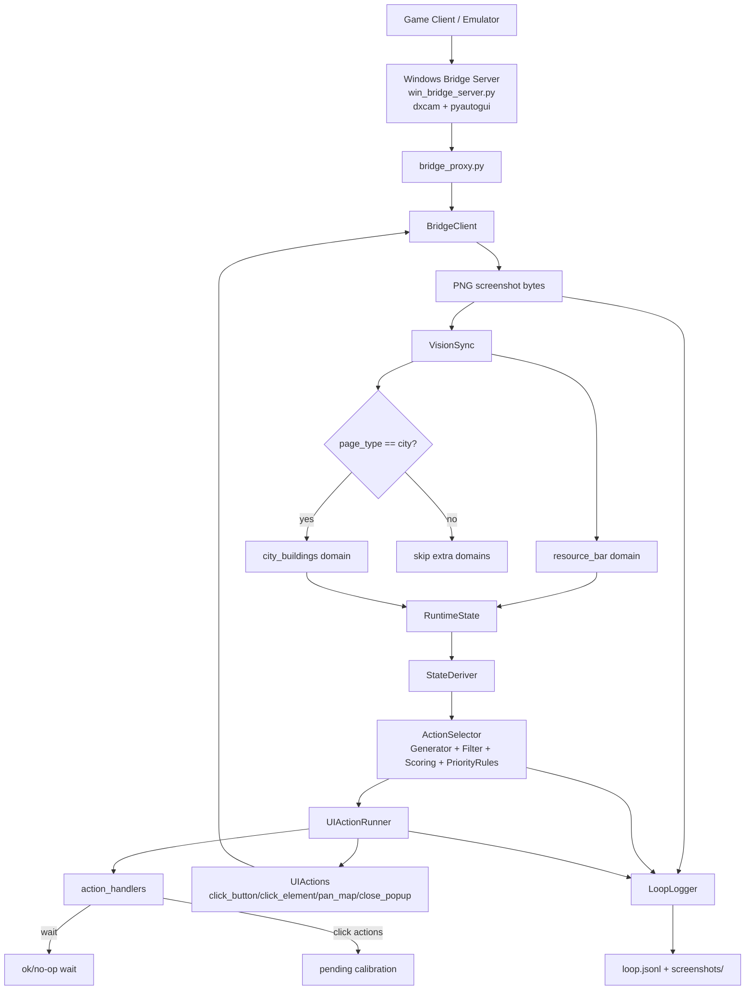
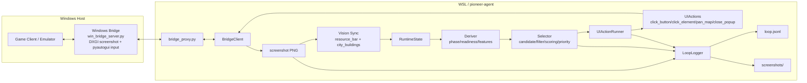
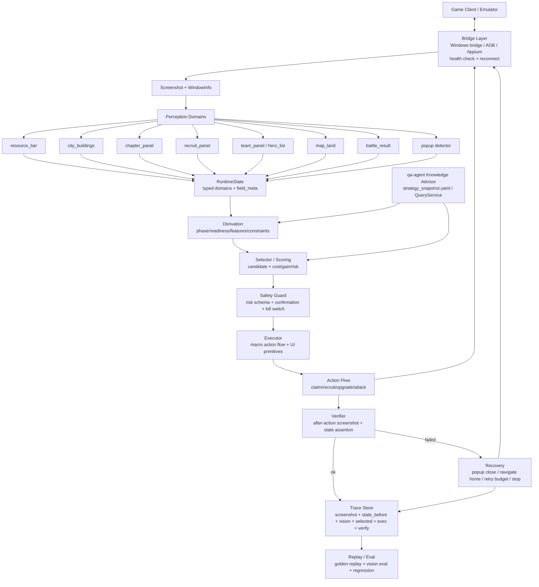

# Sanmou Monorepo / Pioneer Agent 架构评审与路线图

> Updated: 2026-05-17. 本次更新将低风险真实自动化闭环、动作后 verifier、safety/recovery、fixture/eval/replay、qa-agent strategy snapshot 明确前置为 P0。

> 2026-07-10 follow-up: 旧 `AgentRuntime.run_once` / `ActionRunner(not_implemented)` / `pioneer_agent.app.main` scaffold 已删除；当前运行入口只保留 Advisor、Replay 与显式 guarded `AutonomousLoop`。下文对旧 scaffold 的描述仅作为当时审计记录。

## 1. Executive Summary

- 当前仓库已经具备清晰的 monorepo 分层：`sanmou-common` 放共享配置，`pioneer-agent` 放开荒 Agent runtime/决策/GUI 自动化，`qa-agent` 放知识问答、RAG、视频证据链和 MCP。
- 当前具备“可运行的 Agent runtime 框架”：`AutonomousLoop` 已串起 `screenshot -> VisionSync -> RuntimeState -> derive -> selector -> UIActionRunner -> LoopLogger`。
- 当前不具备可托管真实账号的 SLG GUI Agent runtime。关键原因是核心点击类 action handler 在 `packages/pioneer-agent/src/pioneer_agent/executor/action_handlers.py` 中仍返回 `pending`。
- 当前不能稳定自动跑前 48 小时开荒。它可以真实截图、有限视觉解析、纯数据决策、记录 loop；但缺真实动作流、动作后 verifier、系统化 recovery、popup handler、安全确认、bridge health、golden replay。
- `pioneer-agent` 的架构方向合理，模块边界基本对齐设计文档；但实现成熟度不均衡：selector/scoring 相对完整，perception 只覆盖 `resource_bar` 与 `city_buildings`，executor 主要是 UI 原语和 pending 宏动作。
- `qa-agent` 已经不是单纯问答壳，而是可作为知识底座的系统：有 `QueryService`、Retriever、MCP、Chat RAG、图像识别、Bilibili 视频 staging/review/publish、正式 `knowledge_sources`。
- `qa-agent` 目前尚未接入 `pioneer-agent`。在 `pioneer-agent` 中未找到 `qa_agent`、`QueryService`、`Retriever` 或 MCP tool 调用。
- `sanmou-common` 当前边界方向正确，但内容偏空：只有 `ConfigLoader` 和 `buildings/chapters/lands/lineups` 模板，尚不足以支撑真实策略。
- `todo-list.md` 记录了大量已完成能力，但 Pending 优先级偏知识补全；真实自动化闭环所需的 verifier/recovery/popup/safety/kill switch/bridge health/golden replay 需要前置。
- 成熟度评分：整体 3/10；runtime 框架 4/10；selector/scoring 5.5/10；perception 3/10；executor 1.5/10；trace/replay 3/10；qa-agent 知识底座 7/10；common 静态数据 1.5/10。

明确回答：当前还没有真实可托管的 SLG GUI Agent runtime；当前不能稳定自动跑前 48 小时开荒。

## 2. 当前仓库结构

```text
sanmou_monorepo/
  README.md
  agent.md
  todo-list.md
  docs/
    bridge-architecture.md
    sanguo-agent-mvp-model.md
    sanguo-agent-runtime-design.md
    sanguo-agent-mvp-engineering-plan.md
    state-snapshot-field-guide.md
    qa-agent-bilibili-video-knowledge-plan.md
    bilibili-video-knowledge-workflow.md
    knowledge-cards/
  packages/
    sanmou-common/
      src/sanmou_common/config/
      src/sanmou_common/glossary/
    pioneer-agent/
      src/pioneer_agent/
        adapters/ app/ config/ core/ derivation/ executor/
        perception/ runtime/ scoring/ selector/ storage/
      tests/unit/
      tests/fixtures/
      data/
    qa-agent/
      src/qa_agent/
        app/ chat/ index/ ingestion/ knowledge/ mcp_server/
        retrieval/ service/ video/ vision/
      knowledge_sources/
      ingestion/raw/
      ingestion/staging/
      ingestion/video_batch/
      tests/
```

| Package | 当前职责 | 评价 |
|---|---|---|
| `packages/sanmou-common` | 共享 YAML loader、模板静态配置 | 边界合理，但真实游戏数据未落地 |
| `packages/pioneer-agent` | 开荒 Agent：状态、派生、候选动作、评分、选择、视觉同步、GUI bridge、runtime loop | 架构骨架合理，真实执行闭环未完成 |
| `packages/qa-agent` | 知识问答、RAG、知识库、ingestion、视频证据链、MCP、图像识别 | 可作为知识底座，但缺 pioneer 接入层 |

README 证据：`README.md` 描述仓库目标为《三国：谋定天下》自动化 Agent 大仓，并给出 `python -m pioneer_agent.app.main`、`python -m pioneer_agent.app.advisor_fixture`、`python -m qa_agent.app.chat`、unittest 命令。README 中测试数量为 `pioneer-agent 59 tests / qa-agent 72 tests`，但 `todo-list.md` 后续记录出现 `pioneer-agent 62 tests`、`qa-agent 107 tests`、`qa-agent 89 tests`，README 很可能滞后。

分包评价：分包方向正确。当前最缺的是跨包契约：`pioneer-agent` 没有 `knowledge/` adapter；`qa-agent` 没有导出面向 runtime 的稳定策略 snapshot；`sanmou-common` 还没有真实静态数据模型。

## 3. 当前 Pioneer Agent 架构

当前 runtime 链路：

```text
BridgeClient.screenshot()
  -> VisionSync.sync()
     -> extract_resource_bar()
     -> if page_type == city: extract_city_buildings()
     -> merge RuntimeState
  -> StateDeriver.derive()
  -> ActionSelector.select()
     -> CandidateGenerator
     -> CandidateFilter
     -> scoring functions
     -> PriorityRules
  -> UIActionRunner.run()
     -> action_handlers.dispatch()
     -> UIActions or pending handler
  -> LoopLogger.log_tick()
  -> sleep
```

当前 Mermaid 架构图：



### perception

证据文件：

- `packages/pioneer-agent/src/pioneer_agent/perception/vision_sync.py`
- `packages/pioneer-agent/src/pioneer_agent/perception/domains/resource_bar.py`
- `packages/pioneer-agent/src/pioneer_agent/perception/domains/city_buildings.py`
- `packages/pioneer-agent/src/pioneer_agent/perception/domains/merge.py`
- `packages/pioneer-agent/src/pioneer_agent/perception/vision/client.py`
- `packages/pioneer-agent/src/pioneer_agent/perception/vision/openai_client.py`
- `packages/pioneer-agent/src/pioneer_agent/perception/vision/locator.py`
- `packages/pioneer-agent/src/pioneer_agent/perception/vision/prompts.py`

当前支持真实截图：`BridgeClient.screenshot()` 返回 PNG bytes；`app/autonomous.py` 和 `app/vision_probe.py` 都可走 live bridge。支持 Gemini 和 OpenAI/sub2api vision provider。支持 `find_elements()` 和 `to_pixel_box()`，能把 0-1000 normalized bbox 转换为窗口像素。

已实现 domain：

- `resource_bar`：识别 `page_type`、军令、资源、货币，写入 `RuntimeState.global_state/economy/field_meta`。
- `city_buildings`：识别繁荣、领地、道路、建筑名称、等级、升级倒计时，写入 `RuntimeState.city`。

未找到或未完成：

- 未找到 `chapter_panel` domain。
- 未找到 `hero_list` domain。
- 未找到 `battle_result` domain。
- 未找到 `team_panel` / `recruit_panel` domain。
- 未找到系统化 `popup` detector。
- 未找到 pioneer 专用 screenshot fixture dataset。
- 未找到 pioneer 视觉 eval harness。

`field_meta` 存在，但当前主要是顶层 domain 粒度，尚未达到每个字段都有 `confidence/source/captured_at` 的程度。

### derivation

证据文件：

- `packages/pioneer-agent/src/pioneer_agent/derivation/state_deriver.py`
- `packages/pioneer-agent/src/pioneer_agent/derivation/phase.py`
- `packages/pioneer-agent/src/pioneer_agent/derivation/readiness.py`

当前能力：派生开服/结榜时间、`phase_tag`、主力平均等级、team container readiness、土地体力缺口/章节相关性/等级适配、建筑章节相关性/资源短缺/等待时间。

主要问题：公式硬编码较多；`RuntimeState` 多为 `dict[str, Any]`；开荒阶段存在，但 `scoring.yaml` 只覆盖 `opening_sprint`，且评分函数没有统一消费配置。

### selector / scoring

证据文件：

- `packages/pioneer-agent/src/pioneer_agent/selector/candidate_generator.py`
- `packages/pioneer-agent/src/pioneer_agent/selector/filters.py`
- `packages/pioneer-agent/src/pioneer_agent/selector/action_selector.py`
- `packages/pioneer-agent/src/pioneer_agent/selector/priority_rules.py`
- `packages/pioneer-agent/src/pioneer_agent/scoring/*.py`
- `packages/pioneer-agent/src/pioneer_agent/config/scoring.yaml`

`CandidateAction` schema 合理，包含 `preconditions/expected_gain/expected_cost/risk/timing/interruptibility/source_state_refs/score_breakdown`。当前 generator 生成领奖、升级、置换、打地、征兵、等待资源、等待体力；`abandon_land` 有 enum 和 handler，但未看到候选生成。过滤器覆盖资源不足、前置不满足、胜率低于 0.9、体力不足、队伍 busy、不可征兵等。priority rules 覆盖章节奖励优先、置换保节奏、主队补兵、章节瓶颈建筑、保留打地窗口。

主要问题：风险模型不是统一 schema；`config/safety.yaml` 未被实际消费；selector 可选中 `attack_land`，但 executor 不能执行；未找到 qa-agent 知识注入点。

### executor

证据文件：

- `packages/pioneer-agent/src/pioneer_agent/executor/action_handlers.py`
- `packages/pioneer-agent/src/pioneer_agent/executor/ui_actions.py`
- `packages/pioneer-agent/src/pioneer_agent/executor/ui_runner.py`
- `packages/pioneer-agent/src/pioneer_agent/executor/runner.py`
- `packages/pioneer-agent/src/pioneer_agent/adapters/bridge_client.py`
- `packages/pioneer-agent/src/pioneer_agent/adapters/win_bridge_server.py`
- `packages/pioneer-agent/src/pioneer_agent/adapters/bridge_proxy.py`

已具备 `UIActionRunner` 和 UI 原语：`click_button`、`click_element`、`pan_map`、`close_popup`。Windows bridge 真实存在：WSL `BridgeClient` -> Windows `bridge_proxy.py` -> `win_bridge_server.py` -> dxcam 截图 + pyautogui 输入。

动作实装状态：

| ActionType | 当前状态 | 证据 |
|---|---|---|
| `claim_chapter_reward` | 当前为 pending | `action_handlers.py` 返回 chapter panel 未标定 |
| `upgrade_building` | 当前为 pending；缺 building_name 时 failed | `action_handlers.py` |
| `recruit_soldiers` | 当前为 pending | `action_handlers.py` |
| `attack_land` | 当前为 pending | `action_handlers.py` |
| `transfer_main_lineup_to_team` | 当前为 pending | `action_handlers.py` |
| `abandon_land` | 当前为 pending | `action_handlers.py` |
| `wait_for_resource` | 已实装 no-op wait | `action_handlers.py` |
| `wait_for_stamina` | 已实装 no-op wait | `action_handlers.py` |

未找到 action retry policy、动作后 verifier、高风险动作拦截、人工确认、manual kill switch。`ActionRunner` 仍是 scaffold，返回 `not_implemented`；真实 autonomous loop 使用 `UIActionRunner`。

### runtime

证据文件：

- `packages/pioneer-agent/src/pioneer_agent/runtime/autonomous_loop.py`
- `packages/pioneer-agent/src/pioneer_agent/runtime/agent_runtime.py`
- `packages/pioneer-agent/src/pioneer_agent/runtime/replay_runtime.py`
- `packages/pioneer-agent/src/pioneer_agent/app/autonomous.py`
- `packages/pioneer-agent/src/pioneer_agent/app/replay_fixture.py`

当前 `AutonomousLoop` 是真实 autonomous loop 骨架，支持 `max_iterations`、`dry_run`、tick exception handling、差异化 sleep、stuck detection。stuck 条件包括 unknown page、无 action、执行 failed/pending，连续超过阈值会发 ESC。

主要问题：recovery 只有 ESC；未找到 scheduler/session lifecycle/bridge health monitor；`ReplayRuntime` 只做 state fixture -> selector replay，不是 screenshot -> vision -> action 的完整 replay；早期 `AgentRuntime.run_once()` 是文件输入模式，不走真实 screenshot bridge，也不走 `UIActionRunner`。

### storage / trace / replay

证据文件：

- `packages/pioneer-agent/src/pioneer_agent/storage/loop_logger.py`
- `packages/pioneer-agent/src/pioneer_agent/storage/logger.py`
- `packages/pioneer-agent/src/pioneer_agent/storage/schema.sql`
- `packages/pioneer-agent/src/pioneer_agent/storage/init_db.py`
- `packages/pioneer-agent/data/agent_runs/real_sync_smoke/*.jsonl`

`LoopLogger` 每 tick 写 `loop.jsonl`，可归档 PNG 到 `screenshots/`。`AgentLogger` 可分开写 `sync.jsonl/state.jsonl/selection.jsonl/execution.jsonl`。SQLite schema 存在，但未看到 runtime 主链路实际落库。

主要缺口：`LoopLogger` 未记录完整 `state_before/state_after`、完整 `vision_summary`、`ranked_actions`、`verification_status`；screenshot 与 state 没有形成强绑定 trace；当前 replay 更像 selector replay，不足以做 golden replay/eval。

### tests

证据文件：

- `packages/pioneer-agent/tests/unit/test_autonomous_loop.py`
- `packages/pioneer-agent/tests/unit/test_ui_actions.py`
- `packages/pioneer-agent/tests/unit/test_ui_registry.py`
- `packages/pioneer-agent/tests/unit/test_action_handlers.py`
- `packages/pioneer-agent/tests/unit/test_action_selector_pipeline.py`
- `packages/pioneer-agent/tests/unit/test_vision_locator.py`
- `packages/pioneer-agent/tests/unit/test_vision_sync.py`
- `packages/pioneer-agent/tests/unit/test_loop_logger.py`
- `packages/pioneer-agent/tests/unit/test_sync_and_replay_cycle.py`

测试覆盖 selector fixture replay、UI 原语、dispatch 表、autonomous loop dry-run/sleep/stuck/exception、VisionSync routing、OpenAI vision request shape、LoopLogger。测试多为 stub/mock；未覆盖真实 bridge；未覆盖真实截图 fixture；pending action 被测试为 pending，说明它们不是实逻辑。

## 4. 当前能力完成度矩阵

| 能力 | 当前状态 | 证据文件 | 成熟度 | 主要缺口 |
|---|---|---|---|---|
| monorepo 工程结构 | 已具备 | `README.md`, `packages/` | 中 | README 滞后，跨包契约不足 |
| domain model | 部分具备 | `pioneer_agent/core/models.py`, `qa_agent/knowledge/models.py` | 中低 | pioneer 状态多为 dict |
| qa knowledge base | 已具备 | `packages/qa-agent/knowledge_sources/` | 较高 | 缺策略 snapshot/API |
| video evidence pipeline | 已具备 | `qa_agent/video/*`, `run_video_pipeline.py` | 较高 | 部分视频仍需人工修正 |
| screenshot bridge | 已具备 | `bridge_client.py`, `win_bridge_server.py` | 中 | 缺健康检查/重连/watchdog |
| vision locator | 已具备 | `perception/vision/locator.py` | 中 | 缺 screenshot eval 数据集 |
| perception domain | 部分具备 | `resource_bar.py`, `city_buildings.py` | 低中 | 缺 chapter/recruit/team/battle/popup |
| runtime loop | 框架具备 | `runtime/autonomous_loop.py` | 中低 | 动作 pending，recovery 薄弱 |
| action selector | 已具备 | `selector/*`, `scoring/*` | 中 | risk/knowledge/config 化不足 |
| action handlers | pending 为主 | `executor/action_handlers.py` | 低 | 核心点击流未实装 |
| UI action primitive | 已具备 | `executor/ui_actions.py` | 中 | 缺宏动作 flow |
| verifier | 未找到 | `executor/`, `runtime/` | 无 | 需独立 verifier |
| recovery | 薄弱 | `AutonomousLoop._is_stuck`, `close_popup` | 低 | 只有 ESC 自救 |
| safety | 很薄弱 | `config/safety.yaml`, `dry_run` | 低 | 配置未消费，无确认/kill switch |
| trace / replay | 部分具备 | `loop_logger.py`, `replay_runtime.py` | 低中 | 缺完整 golden trace |
| tests | mock 覆盖较多 | `packages/pioneer-agent/tests/unit/` | 中 | 缺真实截图和 verifier tests |
| qa-agent integration | 未找到 | `pioneer-agent` 中无调用 | 无 | 需 adapter/snapshot |

## 5. 当前主要问题

1. 核心 action handler 是 pending。`claim_chapter_reward/upgrade_building/recruit_soldiers/attack_land/transfer_main_lineup_to_team/abandon_land` 都没有真实动作序列。
2. verifier 缺失。`ExecutionResult.verification_status` 字段存在，但没有动作后截图、感知和状态断言。
3. recovery 薄弱。当前只有连续 stuck 后 ESC，不能处理登录、断线、确认框、页面错位、bridge 卡死、半执行失败。
4. safety 不足。`safety.yaml` 没有被执行链消费；未找到 high-risk confirmation、manual kill switch、risk policy、不可逆动作保护。
5. perception domain 不完整。真实开荒至少需要 `chapter_panel/recruit_panel/team_panel/hero_list/map_land/battle_result/popup`。
6. bridge 仍需长跑能力。缺截图黑屏/卡帧检测、窗口变化校验、输入失败重试、自动重启 bridge server。
7. qa-agent 尚未接入 pioneer。知识库可用，但 selector/scoring 没有使用它。
8. common 静态数据不完整。`buildings.yaml/chapters.yaml/lands.yaml/lineups.yaml` 仍是模板，不能支撑真实规划。

## 6. Todo List 重排

### 已完成

`todo-list.md` 已完成项可归纳为：monorepo 初始化；pioneer 决策链；Windows bridge；dxcam 截图；Gemini/OpenAI vision；`resource_bar`、`city_buildings`；vision locator；UI registry；UIActions；autonomous loop；LoopLogger；dry-run/stuck threshold；qa-agent MCP/chat/RAG/OpenAI/vision；Bilibili workflow；Kdocs/sgmdtx/视频知识入库。

### P0：真实自动化闭环必做

| 任务描述 | 为什么做 | 验收标准 | 涉及目录/文件 |
|---|---|---|---|
| `chapter_panel` domain | 领奖是最低风险闭环入口 | 实拍截图能识别章节号、可领奖、按钮 bbox、field_meta | `pioneer_agent/perception/domains/`, `vision/prompts.py`, `tests/fixtures/screenshots/` |
| `claim_chapter_reward` flow | 第一个真实低风险 action | 能打开章节面板、点击奖励、处理确认/关闭，非 dry-run 返回 `ok` | `executor/action_handlers.py`, `executor/flows/claim_chapter_reward.py` |
| claim chapter verifier | 没 verifier 不能托管 | 动作后截图确认 `chapter_claimable=false` 或章节状态变化 | `pioneer_agent/verifier/claim_chapter.py` |
| `recruit_panel` domain | 征兵是低风险高频动作 | 识别队伍、兵力、可征兵、确认按钮、倒计时 | `perception/domains/recruit_panel.py` |
| `recruit_soldiers` flow | 打通第二个低风险闭环 | 能进入征兵界面、选择队伍/数量、确认或安全退出 | `executor/flows/recruit_soldiers.py` |
| recruit verifier | 防止重复点击和误判 | 验证兵力变化、征兵倒计时或预备兵减少 | `verifier/recruit.py` |
| `upgrade_dialog` domain | 建筑升级需要确认框结构化识别 | 识别资源消耗、升级按钮、不可升级原因、关闭/取消按钮 | `perception/domains/upgrade_dialog.py` |
| `upgrade_building` low-risk flow + verifier | 建筑升级是开荒核心 | 只允许白名单低风险建筑；动作后验证等级变化、倒计时或资源消耗 | `executor/flows/upgrade_building.py`, `verifier/building.py` |
| popup detector/handler | 弹窗会阻断所有 flow | 识别确认/取消/关闭/错误弹窗，并可由 executor 调用 | `perception/domains/popup.py`, `executor/popup_handler.py` |
| verifier framework | 无动作后验证就不能托管 | 每个可执行动作声明 expected state delta、verify timeout；无 verifier 不自动执行 | `pioneer_agent/verifier/` |
| safety guardrail | 防真实 GUI 误操作 | 所有动作执行前经过 risk policy；高风险默认 blocked/confirmation | `pioneer_agent/safety/`, `config/safety.yaml` |
| manual kill switch | 长跑必须可接管 | 每 tick 检查 kill file/hotkey/flag，触发后停止输入并写 log | `runtime/autonomous_loop.py`, `app/autonomous.py` |
| high-risk confirmation | 防不可逆/中高风险误操作 | `attack_land/abandon_land/transfer_main_lineup` 默认 require confirmation | `pioneer_agent/safety/`, `executor/ui_runner.py` |
| bridge health check | bridge 不稳定会误操作 | 周期检查 ping、window_info、截图非黑屏；失败进入 recovery | `adapters/bridge_client.py`, `runtime/health.py` |
| click-action calibration | 当前点击类 action 仍为 pending | claim/recruit/upgrade/attack/transfer/abandon 用真实截图完成 `ui_calibrate` + `find_elements` 序列 | `app/ui_calibrate.py`, `executor/action_handlers.py` |
| screenshot fixture dataset | 无实拍 fixture 无法安全重构 | 覆盖 city/chapter/recruit/popup，每张有 expected JSON | `tests/fixtures/screenshots/` |
| vision eval baseline | 防 perception prompt/domain 回归 | 基于 screenshot fixture 输出 page/domain/entity accuracy | `perception/eval/`, `tests/fixtures/screenshots/` |
| golden replay tests | 防视觉/selector/executor 回归 | 固定截图序列可重放到期望 action 和 verifier 结果 | `tests/unit/test_golden_replay.py`, `storage/trace_store.py` |
| qa-agent -> pioneer strategy snapshot | 避免 runtime 每 tick 依赖 LLM | 生成 `strategy_snapshot.yaml`，pioneer 可加载用于 selector/scoring | `qa_agent/app/export_strategy_snapshot.py`, `pioneer_agent/knowledge/` |

### P1：策略与数据质量

| 任务描述 | 为什么做 | 验收标准 | 涉及目录/文件 |
|---|---|---|---|
| 补齐全阶段 `scoring.yaml` | 当前只有 `opening_sprint` | 四阶段权重可配置，scoring 实际消费配置 | `config/scoring.yaml`, `scoring/` |
| 统一 risk schema | 当前 risk 散落 | `CandidateAction.risk` 有 level/reason/confirm_required/irreversible | `core/models.py`, `core/risk.py`, `safety/` |
| common 建筑表 | 建筑升级需要真实成本/前置 | 建筑 id、等级、成本、前置、收益完整 | `sanmou_common/config/buildings.yaml` |
| common 章节表 | 章节推进要静态任务驱动 | 章节任务、奖励、claim 条件可被 deriver 使用 | `sanmou_common/config/chapters.yaml` |
| common 土地表 | 打地风险/收益需基线 | 1-12 级地收益、守军强度、经验、风险标签 | `sanmou_common/config/lands.yaml` |
| phase-aware strategy | 不同阶段策略不同 | selector/scoring 按阶段切换动作优先级和风险阈值 | `derivation/phase.py`, `selector/`, `scoring/` |

### P2：知识库补全

| 任务描述 | 为什么做 | 验收标准 | 涉及目录/文件 |
|---|---|---|---|
| 职业二阶天赋细节 OCR 补全 | 影响职业选择 | 7 条概述升级为有数值/来源/置信度 | `qa-agent/knowledge_sources/` |
| 同兵种加成数值 | 影响阵容/兵种评估 | 骑/枪/弓/盾数值完整，有 source_ref | `qa-agent/knowledge_sources/combat.yaml` |
| 征兵所数值表 | 影响征兵和建筑优先级 | 各等级征兵数/上限可查，可导出 common | `building.yaml`, `sanmou_common/config/buildings.yaml` |
| 道具产出细节 | 影响恢复/资源策略 | 救治药/行军丹/青囊产出有可靠来源 | `resource_team.yaml` |
| 词条缺口确认 | 防 alias/新词条混淆 | 「完璧」「磐石」归类为新词条或别名 | `configs/*_aliases.yaml`, `knowledge_sources/` |
| 坐骑特技效果数值 | 长期策略质量 | 10 个特技有数值、来源、置信度 | `qa-agent/knowledge_sources/` |
| 紫卡/缘分补录 | 低优知识完整性 | 紫卡和缘分条目可查询 | `profiles/` |

### P3：工程质量与测试

| 任务描述 | 为什么做 | 验收标准 | 涉及目录/文件 |
|---|---|---|---|
| CI/CD 测试和 lint | 防多包回归 | PR 自动跑 pioneer/qa/common tests 和 lint | repo CI config |
| 收敛 runtime 入口 | `AgentRuntime` 与 `AutonomousLoop` 容易混淆 | README/入口明确，旧 scaffold 删除或标 deprecated | `runtime/agent_runtime.py`, `app/main.py` |
| trace schema 统一 | 支撑 replay/eval | 每 tick 有 screenshot、state_before、vision、state_after、selected、exec、verify | `storage/trace_store.py` |
| bridge mock/e2e harness | GUI 自动化需可测 | mock bridge 模拟截图和输入响应；真实 bridge smoke 可手动跑 | `tests/`, `adapters/` |
| vision eval harness | 防视觉 prompt 退化 | 固定截图集跑 precision/recall 和 diff report | `perception/eval/` |
| action flow tests | 防 executor 改坏 | 每个低风险动作有 scripted bridge + verifier 单测 | `tests/unit/test_action_flows.py` |

### P4：长期增强

| 任务描述 | 为什么做 | 验收标准 | 涉及目录/文件 |
|---|---|---|---|
| Plan 2 新视频专项 rerun | 仅高价值视频值得跑 | 字幕空洞但高价值视频启用 frame enrichment | `qa-agent/ingestion/video_batch/`, `scripts/` |
| Plan 2 成本/参数调优 | 降低 ingestion 成本 | 有 frame interval / model A/B 报告 | `qa_agent/video/`, `scripts/` |
| 自动打地闭环 | 中高风险动作，需 P0/P1 后做 | 选地、出征、战报解析、连续失败停止 | `map_land.py`, `attack_land.py`, `battle_result.py` |
| 48 小时托管 | 最终目标 | 测试账号长跑，有人工接管、安全停机、replay | `runtime/`, `safety/`, `storage/` |

优先级调整：应前置 verifier、recovery、popup handler、safety guardrail、manual kill switch、bridge health check、screenshot fixture dataset、golden replay tests、qa-agent 接入；应延后紫卡补录、缘分补录、旧视频 batch rerun 和成本调优。

## 7. 当前架构图



## 8. 目标架构图



## 9. 建议目标目录结构

```text
packages/pioneer-agent/src/pioneer_agent/
  app/
  core/
    action_schema.py
    state_schema.py
    risk.py
  perception/
    vision/
    domains/
      resource_bar.py
      city_buildings.py
      chapter_panel.py
      recruit_panel.py
      team_panel.py
      hero_list.py
      map_land.py
      battle_result.py
      popup.py
    eval/
  derivation/
  selector/
  scoring/
  executor/
    flows/
      claim_chapter_reward.py
      recruit_soldiers.py
      upgrade_building.py
      attack_land.py
    ui_actions.py
    ui_runner.py
    popup_handler.py
  verifier/
    base.py
    claim_chapter.py
    recruit.py
    building.py
    attack_land.py
  recovery/
    recovery_manager.py
    strategies.py
    navigation.py
  knowledge/
    advisor.py
    strategy_snapshot.py
    qa_query_adapter.py
  runtime/
    autonomous_loop.py
    scheduler.py
    session.py
    health.py
  storage/
    loop_logger.py
    trace_store.py
    replay_runtime.py
    schema.sql
  adapters/
    bridge_client.py
    bridge_proxy.py
    win_bridge_server.py
    adb_bridge.py
    appium_bridge.py
  safety/
    guard.py
    policy.py
    kill_switch.py
```

## 10. 里程碑计划

### Milestone 1：低风险自动化闭环

目标：自动领取奖励、自动征兵、自动升级低风险建筑、动作后可验证、失败可恢复。

验收标准：连续运行 30 分钟不崩溃；完成至少 3 类低风险动作；每个动作有 verifier；每个 tick 有 log 和 screenshot；popup 出现时能识别并安全关闭；pending/failed 动作不会无限重复点击。

### Milestone 2：半自动开荒 Advisor

目标：自动观察状态、自动给出下一步建议、高风险动作人工确认、低风险动作自动执行、qa-agent 知识进入 selector/scoring。

验收标准：能基于当前阵容、资源、章节、建筑和 qa 知识输出可解释建议；`attack_land/abandon_land/transfer_main_lineup` 默认 require confirmation；建议引用知识来源或策略快照版本。

### Milestone 3：自动打地闭环

目标：自动选目标地、自动出征、自动等待战斗结果、自动解析战报、连续失败自动停止。

验收标准：`map_land` domain 识别候选土地；`battle_result` domain 解析胜负、战损、经验；连续 2 次高战损或失败时进入 stop/recovery；每次出征可 replay。

### Milestone 4：前 48 小时开荒托管

目标：在测试账号上实现低中风险动作长时间自动化，有人工接管、安全停机、资源上限、replay 复盘。

验收标准：测试账号连续运行多个小时不崩溃；低风险动作自动执行，中风险动作按策略执行或确认，高风险动作默认人工确认；bridge/vision/executor/recovery 全链路有健康指标；关键事故可通过 trace store 回放定位。

## 11. 最重要的下一步

1. `chapter_panel` domain
   - 修改/新增文件：`packages/pioneer-agent/src/pioneer_agent/perception/domains/chapter_panel.py`、`packages/pioneer-agent/src/pioneer_agent/perception/vision/prompts.py`、`packages/pioneer-agent/tests/unit/test_chapter_panel_domain.py`
   - 原因：领奖是最低风险且最适合打通端到端闭环的动作。
   - 验收标准：给定章节截图 fixture，能输出章节号、可领奖、按钮 bbox、field_meta。

2. `claim_chapter_reward` flow
   - 修改/新增文件：`packages/pioneer-agent/src/pioneer_agent/executor/flows/claim_chapter_reward.py`、`packages/pioneer-agent/src/pioneer_agent/executor/action_handlers.py`
   - 原因：当前 handler 是 pending，必须先实装一个低风险动作。
   - 验收标准：scripted bridge 测试通过；真实 dry-run 能定位按钮；非 dry-run 能完成领奖。

3. `claim_chapter_reward` verifier
   - 修改/新增文件：`packages/pioneer-agent/src/pioneer_agent/verifier/claim_chapter.py`、`packages/pioneer-agent/tests/unit/test_claim_chapter_verifier.py`
   - 原因：没有动作后验证就不能自动循环。
   - 验收标准：动作后截图确认 `chapter_claimable=false` 或章节/任务状态变化。

4. `recruit_panel` domain
   - 修改/新增文件：`packages/pioneer-agent/src/pioneer_agent/perception/domains/recruit_panel.py`、`vision/prompts.py`
   - 原因：征兵是高频低风险动作，是 30 分钟长跑的核心。
   - 验收标准：能识别队伍、当前兵力、最大兵力、预备兵、可征兵按钮/确认按钮。

5. `recruit_soldiers` flow
   - 修改/新增文件：`packages/pioneer-agent/src/pioneer_agent/executor/flows/recruit_soldiers.py`、`action_handlers.py`
   - 原因：把当前 pending 的征兵动作变成真实可执行动作。
   - 验收标准：可按 `team_id/recruit_amount` 执行，遇到资源不足/队伍 busy 安全退出。

6. `recruit_soldiers` verifier
   - 修改/新增文件：`packages/pioneer-agent/src/pioneer_agent/verifier/recruit.py`
   - 原因：防止重复征兵、误点、状态未变化。
   - 验收标准：验证兵力增加、倒计时出现或预备兵减少三者之一。

7. popup detector + popup handler
   - 修改/新增文件：`packages/pioneer-agent/src/pioneer_agent/perception/domains/popup.py`、`packages/pioneer-agent/src/pioneer_agent/executor/popup_handler.py`
   - 原因：确认框、错误框、奖励弹窗会阻断所有 action flow。
   - 验收标准：识别确认/取消/关闭按钮；flow 可调用 handler 关闭或确认。

8. safety guardrail
   - 修改/新增文件：`packages/pioneer-agent/src/pioneer_agent/safety/guard.py`、`packages/pioneer-agent/src/pioneer_agent/core/risk.py`、`packages/pioneer-agent/src/pioneer_agent/config/safety.yaml`
   - 原因：真实 GUI 输入必须统一拦截高风险动作。
   - 验收标准：`attack_land/abandon_land/transfer` 默认 blocked 或 require_confirmation；低风险白名单可自动执行。

9. `upgrade_building` low-risk flow
   - 修改/新增文件：`packages/pioneer-agent/src/pioneer_agent/executor/flows/upgrade_building.py`、`packages/pioneer-agent/src/pioneer_agent/verifier/building.py`
   - 原因：建筑升级是开荒核心，但必须先限制在低风险建筑/明确确认框。
   - 验收标准：只对白名单建筑执行；动作后验证等级变化或升级倒计时。

10. qa-agent 接入 pioneer-agent advisor
    - 修改/新增文件：`packages/pioneer-agent/src/pioneer_agent/knowledge/advisor.py`、`packages/pioneer-agent/src/pioneer_agent/knowledge/strategy_snapshot.py`、`packages/qa-agent/src/qa_agent/app/export_strategy_snapshot.py`
    - 原因：qa-agent 的阵容、建筑、打地知识应进入决策，但 runtime 不应每 tick 依赖 LLM。
    - 验收标准：生成离线 `strategy_snapshot.yaml`；selector/scoring 可读取建筑优先级、阵容建议、土地风险阈值；无 qa-agent 环境时有 fallback。

## 不确定项与需要进一步确认的文件

- 未运行测试。原因：本次以架构评估为主，运行测试可能更新缓存或运行时文件；报告基于源码、文档和现有 fixture 审计。
- 未验证 Windows bridge 当前是否正在运行或能连接真实游戏窗口。代码支持真实 bridge，但本次没有启动 bridge。
- 未检查 `packages/pioneer-agent/nul` 的来源和影响。它像是 Windows 保留名遗留文件，当前不计入 runtime 能力。
- 未确认 README 测试数量与当前实际 unittest 数量的精确差异；`todo-list.md` 显示后续测试数量多次变化，README 明显更旧。
- 未把 `packages/qa-agent/ingestion/video_batch/` 作为正式知识来源评估；正式知识源以 `packages/qa-agent/knowledge_sources/` 和 `ingestion/staging/videos/` 为准。
