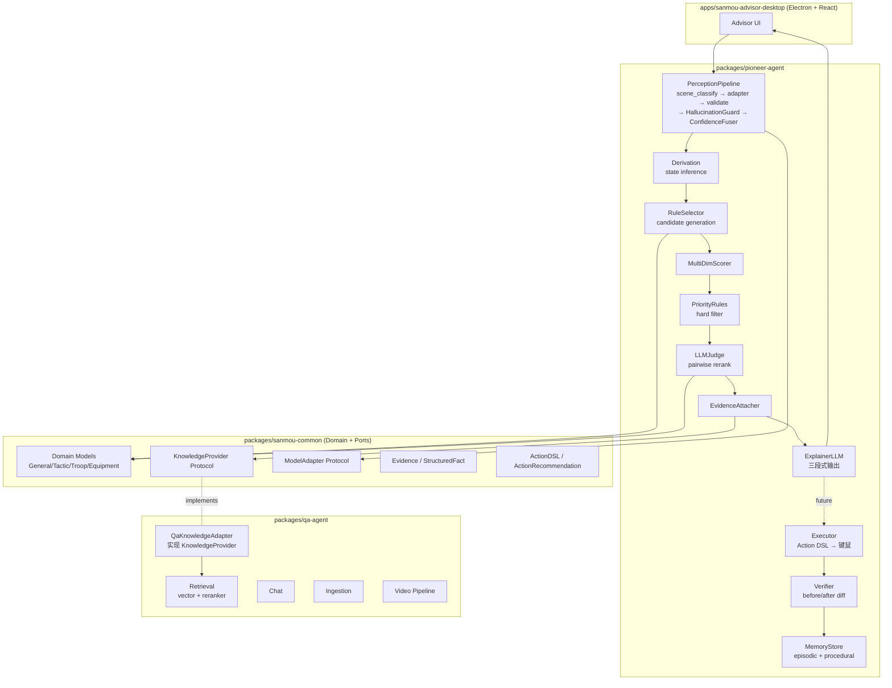
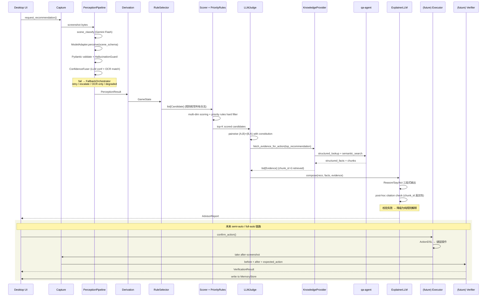

# 三国 SLG Agent 架构设计文档

**从 Advisor 到可托管 Agent 的演进路线**

> sanmou_monorepo 内部架构 ADR · v1.0 · 2026-05-18

> **状态：历史架构输入，不是当前仓库事实源。** 第 2 节的 ports、qa-agent 集成、perception、executor、verifier 与测试成熟度只代表 2026-05-18 快照；当前产品目标、实现校正和 PR review 规则以 `README.md`、`AGENTS.md`、`docs/opening-runbook-architecture.md` 和 `docs/sanmou-monorepo-architecture-iteration-path.md` 为准。发生冲突时以后者和当前代码为准。

## 目录

1. [执行摘要](#1-执行摘要)
2. [现状深度分析](#2-现状深度分析)
3. [业界对标研究](#3-业界对标研究)
4. [目标架构设计](#4-目标架构设计)
5. [迁移路径](#5-迁移路径)
6. [风险与权衡](#6-风险与权衡)
7. [附录](#7-附录)

---

## 1. 执行摘要

sanmou_monorepo 是一套面向《三国：谋定天下》的**截图驱动辅助决策 Advisor + RAG 知识问答双 Agent 系统**。Python monorepo，三个核心包 sanmou-common / pioneer-agent / qa-agent，加一个 Electron+React 桌面端，共 23k 行源码、8k 行测试，测试占比约 34%。当前形态是 Advisor（向人类玩家给建议），中长期目标是演进到可托管 Agent（semi-auto → full-auto）。

本文档的第一个核心结论是：**架构方向正确，瓶颈在执行链路而非架构理念**。pioneer-agent 现有的 perception → derivation → selector → recommendation 三段切分，与业界主流截图驱动 Agent（Cradle、Voyager、SIMA 2）的模块切分高度一致；selector 内部的"候选生成 + 多维打分 + priority rules 硬规则"也契合 CICERO 的 plan-then-explain 模式与 AlphaStar 的 hierarchical action 思想。这套骨架值得保留，不需要推倒。

第二个核心结论是：**两个 Agent 实质孤立运行是当前最大架构债**。pioneer-agent 给玩家"建议出张飞配某战法"，但说不出"为什么"——而 qa-agent 恰恰有这些攻略、视频字幕、武将搭配的 RAG 知识底座（自评 7/10，是整个 repo 最成熟的模块）。把 qa-agent 接入 pioneer-agent，让每条 ActionRecommendation 携带可校验的 evidence，是当前提升 Advisor 可信度与产品差异化的**最大杠杆点**，且实现成本（一周内可跑通最小闭环）远低于补 executor 或写离线 eval。

第三个核心结论是：**LLM 输出可靠性闭环未做透**。三个表现：vision 层用了 Gemini response_schema 但*没有做 Pydantic 跨字段后校验*——constrained decoding 只保 syntactic（JSON 形状合法），不保 semantic（坐标在屏内、enum 之外的字符串合法、scene 与 region 一致）；chat 层引用 entry_id 时*没有 post-hoc 校验*，LLM 编造一个不存在的 id 也能直出；Gemini 还硬编码在 perception 模块里，没有真正的 ModelAdapter 抽象，无法 A/B 测试 GPT-4V / Claude vision，也没有降级链路。这三个缺口是从 Advisor 演进到可托管 Agent 的**结构性阻塞**。

本文档的关键建议浓缩为三句话：

1. 决策架构采用 "**规则生成候选 → multi-dim scoring → priority rules 硬过滤 → LLM-as-judge pairwise 重排 → RAG 附 evidence → LLM 仅做 explanation 合成**"。
2. 用 `typing.Protocol` 在 sanmou-common 中定义 `KnowledgeProvider`、`ModelAdapter`、`Evidence` 三类跨包契约，pioneer-agent 仅依赖抽象，qa-agent 提供 adapter 实现，遵循 Hexagonal Architecture。
3. 演进分三阶段——Phase 1 跨包契约 + LLM 可靠性闭环（4-6 周），Phase 2 qa-agent 接入 + LLM-Judge + 离线 eval（6-8 周），Phase 3 executor + verifier + 灰度托管（3-6 月）。

---

## 2. 现状深度分析

### 2.1 三包职责边界与模块切分

**sanmou-common** 作为 domain layer 职责清晰，承载游戏静态配置（武将、战法、兵种、羁绊等）与共享数据模型。但有一个关键缺口：*没有 ports 层*——即没有定义跨包契约的 Protocol/ABC。这导致 pioneer-agent 与 qa-agent 之间没有"接缝"，是 Hexagonal Architecture 教科书里的反模式。补 ports 层是 Phase 1 的第一个里程碑。

**pioneer-agent** 内部 perception / derivation / scoring / selector / executor / safety / verifier 的子模块划分本身是合理的，与 Cradle 6 模块（Information Gathering / Self-Reflection / Task Inference / Skill Curation / Action Planning / Memory）大体对应。但成熟度高度不均衡：scoring + selector 已经有可用的多维打分和 priority rules（自评 5.5/10），perception 因为 Gemini 强耦合扣分（3/10），executor 几乎是空壳（1.5/10），verifier 整个目录缺失。

**qa-agent** 的 retrieval / chat / ingestion / video 工程完成度最高（自评 7/10），尤其是 B 站视频证据链 staging → review → publish 的多阶段流程显示了对"数据质量"的工程把控。但它自带的 vision 模块与 pioneer-agent 的 perception 模块功能重复——两边都在做"截图理解"，应当合并到同一个 PerceptionPipeline，由 ModelAdapter 抽象选择不同 backend。

### 2.2 advisor_loop 主循环评估

当前主循环 `capture → vision_sync → derive → select → recommend` 是经典的 perceive-think-act 三段，对单回合 SLG 决策足够。但与 Cradle 的 6 模块架构对比，**缺失三块**：

**Self-Reflection / Verifier**：动作执行后没有"看一眼新截图判断是否生效"的机制。这是 Voyager 和 Cradle 都强调的"必须落地"的一环——self-verification 是从 advisor 升级到 auto 的前置条件。

**Memory**：没有 episodic memory（最近 N 步的状态-动作对）也没有 procedural memory（策略模板库）。每次推荐都是"无状态"的，无法形成"我建议过 X，玩家拒绝了，下次降权重"这种迭代。

**Skill Curation**：候选动作生成纯靠规则枚举，没有"成功策略 → 入库 → 下次 retrieval 复用"的闭环。这一块短期不紧迫，但长期是 self-improvement 的基础。

### 2.3 LLM 工程质量评估

vision 层用了 Gemini `response_schema`，方向正确，但**缺一层 Pydantic 后校验**。Google 官方文档原文："structured output guarantees syntactically correct JSON, it does not guarantee the values are semantically correct"——也就是说，schema 不会阻止模型输出"x+w 超过屏幕宽度"或"scene_type=battle 但战斗区域 bbox 为空"这种语义错误。Pydantic v2 的 `@model_validator(mode='after')` 是补这层校验的标准做法。

SYSTEM_PROMPT 的 evidence-based 设计是亮点——强制 chat 在回答时引用 `[entry_id]`。但**缺 post-hoc 校验器**：LLM 编造一个 `[entry_id=999999]` 也能直出到前端。学术界（Citation-Enhanced Generation, arxiv 2402.16063）已经形式化了这个流程：retrieve → 生成时强制只能引用 retrieved 集合中的 id → 后端 deterministic check chunk_id ∈ retrieved_ids → 不通过则 reject 或降级。本项目应在 chat 出口加这一层 validator。

多 LLM 客户端抽象（gemini / openai / minimax）*形式上存在但不够干净*。perception 层直接 `import gemini_client`，没有走 ModelAdapter Protocol；要 A/B 测试 GPT-4V 必须改 perception 代码而不是改 config。这是 Phase 1 重构的核心目标之一。

### 2.4 决策层混合架构成熟度

"候选动作生成 + 多维打分 + priority rules 硬规则"这个三层架构是**教科书正确的**：候选生成保证合法性（规则枚举），多维打分保证可微调（权重 externalize），priority rules 提供硬约束（不可逾越）。这与 CICERO 的"piKL planner 产 intent → dialogue LM 在 intent 条件下生成消息"思想同源，与 AlphaStar 的 hierarchical action head 也契合。

但**缺两层**：

**(a) LLM-as-judge 重排**：top-K 候选打分接近时，让 LLM 做 pairwise 比较打破平局，引入 LLM 的语义判断又不让它创造方案，是 Zheng et al. (NeurIPS 2023) 推荐的稳健模式。

**(b) RAG evidence 注入**：最终 recommendation 应携带"为什么"的可校验证据（KB chunks + structured facts），而不是只输出 action_id。

### 2.5 测试体系

34% 测试占比对 Python 项目算合格。unittest + fixture 选型主流。但**缺一类关键测试：离线 eval 框架**——录制玩家成功轨迹形成 golden replay set（截图序列 + 期望推荐），定期跑回归测试输出字段级 precision/recall 与推荐准确率。WebArena / OSWorld 已经验证 execution-based eval（看最终状态而非看每步 log）比单元测试更能反映 Agent 真实表现。golden set 应该是 Phase 2 的产出物。

### 2.6 工程红旗清单

| 编号 | 红旗 | 风险 | 优先级 |
|------|------|------|--------|
| R1 | Gemini 在 perception 模块强耦合，没有 ModelAdapter 抽象 | 无法 A/B 测试其他模型；Gemini 一旦改 API 或限流，整个 vision 链路瘫痪 | **P0** |
| R2 | 跨包接口未定义（sanmou-common 缺 ports 层） | pioneer-agent 和 qa-agent 无法解耦协作；强行集成会产生循环依赖 | **P0** |
| R3 | entry_id / chunk_id 引用无 post-hoc 校验 | LLM 编造的 id 会直出到前端，Advisor 可信度受损 | **P0** |
| R4 | vision response_schema 后无 Pydantic 跨字段校验 | 语义错误（如坐标越界、scene-region 不一致）通过校验进入决策链路 | **P0** |
| R5 | chat history 无压缩，sliding window + summary 缺失 | 长对话 token 线性增长，成本不可控且超 context 后会硬截断 | **P1** |
| R6 | executor 几乎 pending（自评 1.5/10） | 阻塞从 Advisor 演进到 semi-auto 的所有路径 | **P1** |
| R7 | verifier 整个目录缺失 | 无 self-reflection，agent 错了也不知道错了 | **P1** |
| R8 | 无 fallback chain（perception 失败直接抛异常） | 线上 LLM 不稳定时整个 advisor 中断 | **P1** |
| R9 | 无离线 eval 框架 | 无法回归测试，模型版本切换是黑盒赌博 | P2 |

---

## 3. 业界对标研究

### 3.1 Voyager（NVIDIA / CalTech, Minecraft, arxiv 2305.16291）

**解决什么**：让 LLM agent 在开放世界中无需 fine-tune 持续自我探索、积累可复用技能，并通过执行反馈自我修正。

**核心技术**：三大组件——(a) *Automatic Curriculum*：GPT-4 根据 inventory 和已完成任务提出"足够新但可达"的下一任务；(b) *Skill Library*：每个技能是一段 JavaScript（Mineflayer API）程序，用其自然语言描述的 embedding 做索引，新任务来时检索 top-5 作 in-context examples；(c) *Iterative Prompting with Self-Verification*：三种反馈通道（环境反馈、执行错误 stack trace、另一个 GPT-4 critic）循环喂回，只有通过 self-verification 的代码才入库。

**对本项目启示**：

1. **Self-verification 必须落地**——这是当前 verifier 缺失的直接对标。用 LLM 接收 "action + before/after 截图解析"直接判 success/fail/partial，并产生 critique 回喂决策。
2. **Skill Library 适配为"策略模板库"**：把"屯田攻略、武将培养路线、攻城套路"以参数化 Python 函数 + 描述 + embedding 索引入库，候选动作生成不再纯靠 LLM 想，而是 retrieval top-k。
3. **code-as-action 慎用**：三国 SLG 的 action space 离散（点击界面 + 有限指令），用 Pydantic 结构化 Action DSL 比生成代码更可控。

### 3.2 Cradle（BAAI, General Computer Control, arxiv 2403.03186）

**解决什么**：让 LMM（GPT-4o）仅以截图为输入、键鼠操作为输出，不依赖任何游戏 API，就能玩 AAA 游戏（Red Dead Redemption 2）和操作软件。**与本项目场景高度匹配的 reference**。

**核心技术**：6 大模块——Information Gathering（OCR + 视觉 grounding + 帧 diff）、Self-Reflection（before/after 截图判断成功/失败）、Task Inference（决定继续当前 task 还是切换）、Skill Curation（动态生成/检索 skill）、Action Planning（高层 plan → 键鼠操作序列）、Memory（episodic + procedural + summary 三层）。代码层是 provider / planner / runner 三层分离，provider 是底层 LLM/工具接口可热切。

**对本项目启示**：

1. **直接复刻 6 模块切分**作为顶层架构——你的 perception / decision / executor 三段扩展为 Cradle 6 模块。
2. **Information Gathering 不要只靠 Gemini 通用 VQA**：补一层"专用 UI 检测"——三国游戏 UI 固定，用 OmniParser / OCR / 模板匹配先把武将卡、资源条、任务面板切出 ROI，再让 Gemini 在 ROI 上做细粒度解析，显著降低幻觉和成本。
3. **Self-Reflection 用 before/after 双截图对比**——这是 Cradle 最实用的设计。
4. **provider/planner/runner 三层抽象**直接套用到 FastAPI 服务。

### 3.3 SIMA / SIMA 2（DeepMind, arxiv 2404.10179）

**解决什么**：训练单一通用 agent 跨多款商业 3D 游戏，仅靠像素 + 语言指令 → 键鼠输出。SIMA 2 以 Gemini 2.5 Flash-Lite 为核心，升级为"推理-行动"agent。

**核心技术**：SIMA 2 输出结构化文本 `<Reason>...</Reason> <Say>...</Say> <Act>...</Act>` 三段式——Reason 是 CoT，Say 是对话/澄清，Act 是解析后的键鼠命令。Action space 是 96 个键盘键 + 鼠标点击 + 离散化位移。

**对本项目启示**：

1. **三段式 schema 极适合本项目**——Pydantic 定义同样结构，一次调用同时拿到推理日志、玩家建议文案、结构化动作。解析失败概率低、可解释性强。
2. **动作语义化**：让 LLM 输出 `attack_city(city_id=X, troop_preset=Y)` 这类语义化 action，executor 再翻译成点击坐标，而不是让 LLM 直接说"点 (520, 340)"。

### 3.4 CICERO（Meta AI, Diplomacy, Science 2022）

**解决什么**：让 AI 在 Diplomacy（自然语言谈判 + 战略博弈）中达到人类水平，核心是 LLM 与 planning/RL 有机结合。

**核心技术**：(a) Controllable Dialogue Model（BART fine-tune）生成时*以 "intent" 为条件*——对话总是围绕某个具体计划展开；(b) Strategic Reasoning Engine（piKL 算法）做迭代式 equilibrium search，平衡"dialogue 一致性"和"理性最优"；(c) *dialogue-free value model*——value 不依赖对话（消息可能造假），抗欺骗关键；(d) 消息多层 filter。

**对本项目启示**：

1. **LLM 应该被 plan 约束，而不是反向**。规则引擎/搜索得到候选 action + 期望收益（相当于 piKL 的 policy），然后 LLM 在此约束下生成自然语言建议文案 + 解释（相当于 controllable dialogue）。这正契合 Advisor 模式。
2. **Value Function 分离**：引入独立的"局势评估"模块，只看客观盘面，避免 LLM 的自圆其说扭曲价值判断。
3. **KL-regularization 思想**：未来 semi-auto 时，新动作（LLM 提议）不能偏离规则引擎 baseline 太远。

### 3.5 AlphaStar / OpenAI Five 架构启示

**解决什么**：在 RTS / MOBA 巨大动作空间、长 horizon、不完全信息下达到/超越人类顶尖。

**核心技术（精华）**：(a) *Hierarchical Action Space*——每个 action head 语义化（"做什么"→"选哪些单位"→"目标位置"），auto-regressive，后续 head condition 于前面 head；(b) *Reward Shaping 极度精细*——多维 reward 加权，零和、time-scaling、team_spirit 系数；(c) Asymmetric Value/Policy——value 看全信息、policy 看部分。

**对本项目启示**：

1. **Action DSL 层级化**：`action_type → sub_target → parameters` 三级，每级独立 Pydantic 校验 + 打分，LLM 也按这个层级 condition 生成。
2. **Reward Shaping = 多维打分函数**——OpenAI Five 提醒你多维权重需要持续 surgery 调优，把权重 externalize 为 config，准备"离线 replay 重新打分"工具链。
3. **不走纯 RL self-play 路线**——没 sim 环境也没算力跑 league，借鉴的应是架构思想而非训练范式。

### 3.6 SwiftSage（NeurIPS 2023, arxiv 2305.17390）

**解决什么**：单一大 LLM 又慢又贵，但小模型不会规划。

**核心技术**：双系统——Swift（小 encoder-decoder LM，BC 训练，做 fast intuitive action）+ Sage（GPT-4 做 subgoal planning + reflective grounding）。启发式调度：常规走 Swift，Swift 不确定/失败时 escalate 给 Sage。

**对本项目启示**：**规则引擎 + 小模型当 Swift（处理 90% 常规决策——收税、征兵），仅在异常/关键决策（开战、外交、突发）才调 GPT-4/Gemini 当 Sage——成本/延迟降一个量级**。这与"Advisor → Auto"的演进路线天然契合：人类先当 Sage，模型先做 Swift。

### 3.7 WebArena / AgentOccam（arxiv 2410.13825）

**解决什么**：在 WebArena 上，AgentOccam 仅通过精修 observation 和 action space（裁掉冗余 UI 元素，引入 branch/prune 让 agent 自组织 plan tree），就比 SOTA 高 29.4%。

**对本项目启示**：**observation/action space alignment 比 prompting 技巧重要得多**。应当花大力气在：(1) 截图解析后输出的结构化"游戏状态" schema 是否冗余/缺失关键字段；(2) action DSL 粒度是否合适。这两个优化 ROI 远高于换更大的 LLM。

### 3.8 AutoGen 多 Agent 框架（Microsoft, arxiv 2308.08155）

**核心技术**：Conversable agents 通过消息收发协作。下棋示例：Board Agent 专门校验落子合法性，没它 LLM 会乱走。

**对本项目启示**：在 executor 之前必经 **Validator Agent**，检查"合法性 + 资源 + 冷却 + 前置条件"——规则引擎 + 简单查表即可，不用 LLM。AutoGen 验证过 Validator 是必备组件，没有它 LLM 会自信地推荐非法动作。

### 3.9 ReAct vs Plan-and-Execute（arxiv 2210.03629）

**ReAct** 在单 prompt 内交替生成 Thought 和 Action，与环境交互。**Plan-and-Execute**（LangChain/LangGraph）先一次产 plan，再用 cheaper LLM 或纯函数 Executor 执行。

**关键工程教训**：AutoGPT/BabyAGI 早期 plan→execute→reflect 循环最常见的失败模式是"hallucination loop"——不停 replan 但从不取得进展。LangChain ReAct agent 在 production 中经常被吐槽 prompt 误解、tool 输出格式漂移导致死循环。

**对本项目启示**：**本项目应走 Plan-and-Execute 而非 ReAct loop**。三国 SLG 回合决策更接近 Plan-and-Execute——每回合给一个全局推荐，无需边走边纠。Planner 输出结构化 DSL（JSON / Pydantic schema），Executor 收到后校验 → 失败直接 fallback 到规则默认，不进 LLM 二次纠错循环。

### 3.10 LLM-as-Judge（Zheng et al., NeurIPS 2023, arxiv 2306.05685）

**核心 takeaway**：强 LLM 当 judge 评估开放式问答可达 >80% agreement with human preference。但三大 bias：*position bias*（换顺序结果会变）、*verbosity bias*（更长答案被偏爱）、*self-enhancement bias*（judge 偏爱自家模型输出）；以及对数学/逻辑判断弱。

**对本项目启示**：

1. **生成与评分解耦**——候选由规则生成，LLM 只 rank/reject，不创造。
2. 缓解 position bias：对每对候选做 (A,B) 和 (B,A) 双向评估并取一致部分，不一致则保留规则原始排序。
3. 缓解 verbosity bias：传给 judge 的候选项内容长度对齐。
4. **Constitution-style guardrails**：把"不能违反阵营羁绊"等硬约束写成显式 rules 作为 judge prompt 前置条件，judge 必须先 verify hard constraints 再打分。

### 3.11 Tree of Thoughts / LATS（arxiv 2305.10601 / 2310.04406）

**核心 idea**：ToT 把 CoT 推广为对 "thought" 的树形搜索（LLM 既是 generator 又是 evaluator + BFS/DFS）；LATS 进一步引入 MCTS。**搜索值得 vs 不值得**：值得——中间状态可廉价模拟/打分、单步决策不可逆、解空间组合爆炸但有结构；不值得——评估一步 = 一次 LLM call、任务路径清晰、需要 sub-second 响应。

**对本项目启示**：SLG advisor 单回合决策时间预算几秒~几十秒，**不适合 LATS 级完整 MCTS**。如果未来要做"看 3 回合"的长程推荐，可借鉴 ToT 的浅层 BFS（深度 2-3、宽度 3）+ 规则 evaluator。

### 3.12 HybridRAG / GraphRAG（arxiv 2408.04948）

**核心结论**：结构化（KG）与非结构化（向量检索）召回互补——KG 适合属性、精确关系、多跳推理；向量适合开放语义、长尾内容。融合后 retrieval accuracy 和 faithfulness 均优于单一方法。

**对本项目启示**：

1. sanmou-common 中的 domain model 天然就是 KG node schema——**不必引入图数据库，用 Python dict / SQLite 即可**实现 O(1) lookup "张飞能装战法 X 吗"。
2. qa-agent 应提供两个独立检索接口：`structured_lookup(entity_id)` 和 `semantic_search(query)`。
3. **两者在 prompt 层合并，不在 retriever 层合并**。解释模板："建议 {general} 装 {tactic}。{tactic} 属性：{structured_facts}。社区反馈：「{chunk_excerpt}」(出处 {chunk_id})"——前半零幻觉，后半带证据。

### 3.13 Evidence-Grounded Action Recommendation（Perplexity / Glass Health / Harvey）

**业界实践**：Perplexity 每个 claim 附 footnote 链接；Glass Health（临床决策）inline citation 到 guidelines / trials，输出 Most Likely / Expanded Differential / Can't Miss 三栏；Harvey（法律 AI）"evidence-mode"。**最常见失败模式是 "citation mismatch"**——链接是真的，但内容并不真支持那句话。

**对本项目启示**：

1. ActionRecommendation 增加 `evidence: list[Evidence]` 字段，`Evidence(chunk_id, source, span, support_strength)` 强 Pydantic 化。
2. **chunk_id 不可由 LLM 自由生成**——LLM 只能从 retrieval 返回的 ids 中选；后端 deterministic `assert chunk_id in retrieved_ids`，否则丢弃。
3. UI 区分"rule-backed reason"（确定性）和"knowledge-backed reason"（RAG，可能误差）。

### 3.14 Citation-Enhanced Generation（CEG, arxiv 2402.16063）

**核心流程**：retrieve → NLI verification（蕴含校验）→ 不通过则重生成，直至每个 claim 都被 entailing citation 支持。

**对本项目启示**：在 chunk_id 真实性校验之上，加一层 NLI 校验——retrieved chunk 是否真的蕴含 claim？不蕴含则降级/移除该 claim。可用小型 NLI 模型（DeBERTa-mnli）或 cheaper LLM call。

### 3.15 Structured Outputs 三家对比

| 维度 | Gemini response_schema | OpenAI Structured Outputs (strict) | Claude SO / tool_use |
|------|-----------------------|-----------------------------------|---------------------|
| 机制 | controlled decoding（OpenAPI 3 子集） | CFG-based constrained decoding | CFG-based（beta）+ tool_use 兜底 |
| 100% schema 符合 | 否（trajectory distortion 已知） | 是（finish_reason=stop 时） | 是（Sonnet 4.5+ beta） |
| optional 字段 | 支持 nullable | 不支持（必须 union `[T, null]`） | 不支持 |
| 跨字段约束 | 否 | 否 | 否 |
| 关键陷阱 | 纯 constrained decoding 有时*不如* prompt 指令；不支持 `default` | schema 编译 cold-start；refusal/length/content_filter 三种失败路径 | extended thinking 与 strict tool 不兼容 |
| 启示 | 必须保留 Pydantic 后校验 | pin 模型版本到 2024-08-06 或更新 | dual-mode（原生 SO + tool_use 降级） |

**共同启示**：constrained decoding 只保 syntactic 不保 semantic。**Pydantic 跨字段 `@model_validator` 是不可省略的一层**，单一真理源用 `model.model_json_schema()` 同时喂三家。

### 3.16 VisualWebArena Set-of-Marks（arxiv 2401.13649）

**核心 idea**：把"预测 (x, y) 坐标"问题转换为"预测 element ID"问题——对每个可交互元素加 bbox + 唯一 ID 叠回截图，让 LLM 输出 id 而非坐标。VLM 不擅长精确像素回归（论文原话）。

**对本项目启示**：三国 SLG 没有 a11y tree，**SoM 范式可直接借鉴**——送图给 LLM 前用轻量本地模型（YOLO 或模板匹配）先框 N 个候选 UI element 编号 1~N 叠回截图，让 LLM 输出 element_id 而非坐标。精度 + 可解释性双赢，且执行时 element_id → 本地 bbox 查表得到坐标。

### 3.17 OSWorld 三大失败模式（NeurIPS 2024）

跨 OS 的桌面 Agent benchmark，人类 72% vs 最强 VLM agent 12%。失败模式：(a) *GUI Grounding*（误判 click 坐标）；(b) *Operational Knowledge*（不知道"右键→属性"这种规约）；(c) *长 horizon*。

**对本项目启示**：失败模式 (b) 对应"知道某将领特殊兵种"等领域知识——**应塞 prompt（domain knowledge pack），不指望 vision 学到**。eval 用"最终决策是否合理"而非"每步字典匹配"——更鲁棒。

### 3.18 CogAgent / SeeClick / ScreenAgent

**CogAgent**（CVPR 2024, arxiv 2312.08914）：高分辨率 cross-module（224×224 主 ViT + 1120×1120 辅助），专门解决 GUI 文字小问题。**SeeClick**（ACL 2024）证明 "improvement in GUI grounding directly correlates with enhanced agent task performance"——grounding 是上游瓶颈。**ScreenAgent**（IJCAI-24）Planning–Acting–Reflecting 三阶段。

**对本项目启示**：

1. 三国 SLG 数字密集，UI 截图缩到 1024 以下会丢字——**送图给 Gemini/GPT-4V 务必走 high-detail 模式**或自己 crop 关键 region 单独高分送。
2. **先单独评测 grounding 能力**（"找到出兵按钮"原子任务），grounding < 70% 时 downstream 决策都白搭。
3. reflect 阶段值得抄——Advisor 给建议后看新截图自检上一条建议是否生效，把 reflect 信号回写 eval。

### 3.19 Python Monorepo 工程实践

**Protocol vs ABC（PEP 544）**：Protocol 是 structural duck typing，运行时不强制；ABC 是 nominal subtyping，必须显式继承。**跨包接口推荐 Protocol**（不强制实现方继承上游类型）+ `@runtime_checkable`（需要 isinstance 时）。

**Hexagonal Architecture in Python**：domain layer 定义 port（Protocol），infrastructure layer 提供 adapter，composition root 注入。

**uv workspaces**：Rust 实现极快、PEP 621 兼容、共享单 lockfile。**~30k LOC / 3-5 包是甜点位**。Apache Airflow（120 distributions, 1.2M LOC）正在生产使用。本项目不需要 Pants/Bazel。

### 3.20 横向对比汇总

| 项目 | 输入观测 | 动作 | 决策核心 | 记忆/技能 | 验证 | 相关性 |
|------|---------|------|---------|----------|------|--------|
| Voyager | 文本化游戏状态 | JS 代码 | GPT-4 prompting | code skill lib + embed | LLM critic | ⭐⭐⭐⭐⭐ |
| Cradle | 截图 + UI 检测 | Python 键鼠 | GPT-4o, 6 模块 | Skill + multi-tier mem | Self-reflection | ⭐⭐⭐⭐⭐ |
| SIMA 2 | 像素 + 文本指令 | 键鼠 token | Gemini Flash-Lite SFT | 模型参数 | (训练中) | ⭐⭐⭐⭐ |
| CICERO | 棋盘 + 对话 | Diplomacy moves | piKL + BC + RL value | 训练数据 | 消息 filter | ⭐⭐⭐⭐ |
| SwiftSage | 文本环境 | 文本动作 | 小 LM + GPT-4 | Trajectory | Sage 反思 | ⭐⭐⭐⭐ |
| AgentOccam | HTML/截图 | 离散 web 动作 | LLM + 精修 obs/act | Workflow memory | Reflection | ⭐⭐⭐⭐ |
| VisualWebArena | 截图 + SoM | element_id | VLM | — | — | ⭐⭐⭐ |
| AutoGen | (框架) | (框架) | 多 agent 对话 | Per-agent | Validator | ⭐⭐⭐ |

---

## 4. 目标架构设计

### 4.1 顶层模块图



### 4.2 关键接口契约

```python
# ============================================================
# sanmou-common/ports.py — 跨包契约（Hexagonal Ports）
# ============================================================
from typing import Protocol, runtime_checkable, Literal, Any
from pydantic import BaseModel
from datetime import datetime

# ---------- Evidence & Knowledge ----------

class Evidence(BaseModel):
    """RAG 证据，必须 post-hoc 校验 chunk_id ∈ retrieval 集合"""
    chunk_id: str
    source: str                          # "bilibili:BV1234" / "wiki:武将培养"
    span: tuple[int, int] | None = None  # 字符级位置
    support_strength: Literal["support", "partial", "neutral"]
    excerpt: str                         # 不超过 200 字片段

class StructuredFact(BaseModel):
    """KG-style 结构化事实，零幻觉"""
    entity_id: str
    entity_type: Literal["general", "tactic", "troop", "equipment", "formation"]
    attributes: dict[str, Any]

@runtime_checkable
class KnowledgeProvider(Protocol):
    """qa-agent 需要实现此 Protocol；pioneer-agent 仅依赖抽象"""

    def structured_lookup(self, entity_id: str) -> StructuredFact | None:
        """精确查找：用于回答 what/which 类问题，零幻觉"""
        ...

    def semantic_search(
        self,
        query: str,
        top_k: int = 5,
        filter_tags: list[str] | None = None,
    ) -> list[Evidence]:
        """向量检索：用于回答 why/how，带 evidence"""
        ...

    def fetch_evidence_for_action(
        self,
        action: "ActionRecommendation",
        game_state: "GameState",
    ) -> list[Evidence]:
        """组合接口：根据 action + 状态获取相关 evidence（top-3）"""
        ...

# ---------- Model Adapter ----------

class ModelMeta(BaseModel):
    name: str
    latency_ms: int
    input_tokens: int
    output_tokens: int
    finish_reason: Literal["stop", "length", "content_filter", "refusal"]

class ModelAdapter(Protocol):
    name: str

    def perceive(
        self,
        image: bytes,
        scene_type: "SceneType",
        schema: type[BaseModel],
        temperature: float = 0.0,
    ) -> tuple[BaseModel, ModelMeta]:
        """统一感知接口，三家 LLM 同 signature"""
        ...

# ============================================================
# sanmou-common/actions.py — Hierarchical Action DSL
# ============================================================

class ActionDSL(BaseModel):
    """层级化动作：action_type → target → parameters（AlphaStar 启示）"""
    action_type: Literal[
        "attack_city", "build_facility", "train_troop",
        "assign_general", "recruit_general", "diplomacy", "wait"
    ]
    target_id: str | None = None
    parameters: dict[str, Any] = {}

class ActionRecommendation(BaseModel):
    action: ActionDSL
    score: float                                 # 综合分
    score_breakdown: dict[str, float]            # 各维度分（military/economy/...）
    reason_rule: str                             # 规则解释，确定性、零幻觉
    evidence: list[Evidence] = []                # RAG 证据，已 post-hoc 校验
    reason_narrative: str | None = None          # LLM 合成解释（可空）
    confidence: float                            # 0-1

class AdvisorReport(BaseModel):
    trace_id: str
    timestamp: datetime
    perception: "PerceptionResult"
    recommendations: list[ActionRecommendation]  # top-N，已重排
    rejected_candidates: list[tuple[ActionDSL, str]]  # (action, reject_reason)
    elapsed_ms: int
```

```python
# ============================================================
# pioneer-agent/judge.py
# ============================================================
class LLMJudge:
    def __init__(
        self,
        adapter: ModelAdapter,
        constitution: list[str],   # priority rules 的自然语言版
    ): ...

    def rerank(
        self,
        candidates: list[ActionRecommendation],
        game_state: GameState,
        top_k: int = 5,
    ) -> list[ActionRecommendation]:
        """
        - 仅对 top_k 做 pairwise (A,B) + (B,A) 双向比较消除 position bias
        - constitution 作为 prompt 前置(必须先 verify hard constraints)
        - 不通过 schema 校验 / 违反 hard rule → 弃用，保留原序
        - 输出长度对齐传给 judge，消除 verbosity bias
        """
        ...

# ============================================================
# pioneer-agent/verifier.py
# ============================================================
class VerificationResult(BaseModel):
    verdict: Literal["success", "partial", "fail", "unknown"]
    critique: str
    failure_category: Literal[
        "popup_blocked", "resource_insufficient", "wrong_scene",
        "click_missed", "ui_changed", "other", None
    ] | None

class ActionVerifier:
    def verify(
        self,
        before: bytes,
        after: bytes,
        expected_action: ActionDSL,
    ) -> VerificationResult:
        """before/after 双截图喂 LLM 判断(Voyager + Cradle 同款)"""
        ...
```

### 4.3 端到端 Sequence Diagram



### 4.4 关键设计决策（ADR 表）

| # | 决策 | 理由 | 替代方案 | 后果 |
|---|------|------|---------|------|
| D1 | 跨包契约用 `typing.Protocol` 而非 ABC | PEP 544 推荐、不强制继承、qa-agent 不必 import sanmou-common 类、适合"不控制所有实现者"场景 | abc.ABC + @abstractmethod | 运行时不强制实现完整接口，需配 `@runtime_checkable` + 单元测试 + mypy strict 补强 |
| D2 | LLM 不创造 ActionRecommendation，只 rerank/explain | 规则枚举候选已覆盖合法空间；LLM 创造引入 hallucinate"不存在卡牌"风险；Zheng et al. 验证 generation-evaluation 解耦是最稳 | LLM 生成 → 规则校验 | 创造性受限于规则覆盖度（可通过 Skill Library 扩展缓解） |
| D3 | Evidence.chunk_id 强制 ∈ retrieval 集合 + post-hoc NLI 校验 | citation mismatch 是 Perplexity/Glass 等公开案例的最常见失败；架构层防护优于事后检测（arxiv 2512.12117） | 仅依赖 LLM 自我约束 | 偶尔 evidence 为空（校验失败）→ UI 降级显示纯规则解释；不影响主推荐 |
| D4 | domain model = in-memory KG，不上 Neo4j | 30k LOC 项目对图查询性能无要求；Python dict / SQLite O(1) lookup 已够用；Neo4j 运维成本不划算 | Neo4j / Memgraph | 多跳查询性能上限受限，但游戏 KG 复杂度低于此瓶颈 |
| D5 | Perception 用 scene-conditioned schema dispatch | 不同 scene（主城/战斗/编队/弹窗）字段差异大；分派后单 schema 字段数降 80%，constrained decoding 速度+质量都好；error surface 小 | 统一大 schema 含 Optional 字段 | 需维护 `SCENE_SCHEMAS` 字典；scene_type 误判会导致后续解析全错（用低 temperature + confidence threshold 缓解） |
| D6 | LLM 输出强制 `<Reason>/<Say>/<Act>` 三段式 | SIMA 2 已验证；一次调用拿到推理日志 + 用户文案 + 结构化动作；调试友好 | 分多次 LLM call | schema 略复杂，但 Pydantic 一次性校验；省 token、省 latency |
| D7 | 工具链用 uv workspaces，不上 Pants/Bazel | ~30k LOC 是 uv 甜点位；Airflow 1.2M LOC 已在用；单 lockfile、editable install、Rust 极快 | Pants / Bazel / Poetry monorepo | affected-test detection 暂不原生支持（手写 git diff 影响分析即可） |
| D8 | 决策架构 Plan-and-Execute，不上 ReAct loop / MCTS | SLG 回合决策预算几秒~几十秒；ReAct loop 延迟、成本、可复现性都不友好；解空间已被规则枚举得彻底，MCTS ROI 低 | ReAct / LATS / Tree of Thoughts | 长程（多回合）规划能力受限——未来可加浅层 BFS（深度 2-3）补充 |

---

## 5. 迁移路径

采用三阶段渐进式迁移，**每阶段都不破坏现有 advisor_loop**。每个里程碑给出明确完成判定标准（DoD），便于进度追踪和 PR review。

### Phase 1：跨包契约 + LLM 可靠性闭环（4-6 周）

**目标**：补齐架构地基，让 pioneer-agent 与 qa-agent 具备协作能力；让 LLM 输出从"祈祷不出错"变为"出错也能优雅降级"。这一阶段不引入新功能，全部是工程加固，但是后续所有演进的前置。

| 里程碑 | 内容 | 完成判定（DoD） |
|--------|------|----------------|
| M1.1 | sanmou-common 引入 `ports.py`：定义 `KnowledgeProvider` / `ModelAdapter` / `Evidence` / `StructuredFact` Protocol | mypy strict 通过；qa-agent 提供 `QaKnowledgeAdapter` 类实现 Protocol；`isinstance(adapter, KnowledgeProvider)` 返回 True；pioneer-agent 单测能 mock KnowledgeProvider |
| M1.2 | ModelAdapter 重构 perception：抽出 GeminiAdapter / OpenAIAdapter / ClaudeAdapter 三个实现，perception 仅依赖 Protocol | 三 adapter 单测全过；config 切换 adapter 不改业务代码；A/B 测试脚本可跑通；Pydantic schema 单一真理源 `model.model_json_schema()` 同时喂三家 |
| M1.3 | PerceptionPipeline 引入 Pydantic 后校验 + HallucinationGuard + ConfidenceFuser | 30 张人工标注 golden 截图上：scene 误判率 < 5%；幻觉 region 名出现率为 0；关键字段（兵力数字）OCR cross-check 后准确率 > 90% |
| M1.4 | FallbackOrchestrator 实现四级降级：retry → escalate model → OCR-only → degraded_flag | 模拟 LLM 注入失败（refusal / length / ValidationError）测试全过；任何单点失败不会让 advisor 整体中断 |
| M1.5 | ChatHistory sliding window + summary 压缩 | 10 轮以上长对话 token 增长趋于平稳（线性 → 对数）；summary 质量人工评估通过 |
| M1.6 | `entry_id` / `chunk_id` post-hoc 校验器 | 注入编造 id 测试：reject 率 ≥ 95%；线上日志看到的 invalid_id 数 → 0 |

### Phase 2：qa-agent 接入 + LLM-as-Judge + 离线 eval（6-8 周）

**目标**：把两个孤立的 Agent 接通；让 Advisor 推荐从"action_id + 分数"升级为"action + reason + evidence + narrative"；建立可量化的回归测试基线。这一阶段是**产品差异化最大跃迁点**。

| 里程碑 | 内容 | 完成判定（DoD） |
|--------|------|----------------|
| M2.1 | pioneer-agent 通过 KnowledgeProvider 调用 qa-agent；composition root 在 app 顶层 wiring | 端到端 demo：截图 → 推荐 → qa-agent 检索 → 返回带 evidence 的 AdvisorReport，全链路 trace 可查 |
| M2.2 | ActionRecommendation 携带 `evidence` 与 `reason_narrative`；ExplainerLLM 三段式输出 | UI 上每条推荐可点击展开看 evidence 出处；citation precision（evidence 真支持率，人工评估）> 80% |
| M2.3 | LLMJudge 实现 pairwise rerank（仅 top-K=5） | 双向 (A,B)+(B,A) 一致率 > 70%；不一致时保留规则原序的路径覆盖单测；judge 引入的延迟 < 1.5s |
| M2.4 | 离线 eval 框架：golden replay set + 字段级 P/R + 推荐准确率 | tests/golden/ 下 ≥ 50 张真实截图（每 scene 5-10 张）+ 期望 PerceptionResult；EvalRunner 输出 markdown 报告；CI 上跑过；模型版本切换可一键回归对比 |
| M2.5 | Skill Library 雏形：参数化策略模板 + embedding 索引 | ≥ 10 个手写策略模板（屯田、点田、培养、攻城、防守 ...）入库；candidate generation 可从 retrieval top-k 拉模板；模板命中率指标进 metric |

### Phase 3：演进到可托管 Agent（3-6 月）

**目标**：从 Advisor 演进到可托管。这一阶段风险最大（UI 自动操作的脆弱性、TOS 风险），**必须先有 Phase 1 的可靠性闭环 + Phase 2 的离线 eval 才能开工**。强制三阶段灰度：Advisor → Semi-Auto（人工 confirm 每步）→ Full-Auto（仅卡点请示）。

| 里程碑 | 内容 | 完成判定（DoD） |
|--------|------|----------------|
| M3.1 | Executor 落地：layered Action DSL → 键鼠点击；用 SoM 范式（YOLO/模板匹配先框 UI 元素再编号） | 50 种核心 action 的 click 准确率 > 95%；UI 改版自动检测（element_id 失配率）告警 |
| M3.2 | Verifier：before/after 截图比对；失败原因分类（popup / resource / click_missed / ui_changed） | golden trajectory 上 verify 准确率 > 85%；False positive（错误判成功）< 5% |
| M3.3 | Safety / Recovery：popup detection、stuck detection、kill switch（玩家移动鼠标、关键词触发、连续失败 N 次自动停） | 注入异常测试：所有 kill switch 触发条件覆盖；停机响应延迟 < 1s |
| M3.4 | 三阶段灰度发布：Advisor → Semi-Auto（每步 confirm）→ Full-Auto（仅卡点请示） | 每阶段 ≥ 1 周内部 dogfooding；上一阶段无 P0 bug 才能进下一阶段 |
| M3.5 | （可选）Curriculum + self-improvement：自动从成功轨迹挖掘策略入 Skill Library | 每周新增模板数 > 2；模板使用率 > 30% |

---

## 6. 风险与权衡

### 6.1 架构风险

**Protocol 不强制 runtime check**：`typing.Protocol` 的 PEP 544 明确说"No runtime semantics will be imposed"——即使没实现接口里的方法，`isinstance(obj, MyProtocol)` 在没有 `@runtime_checkable` 时甚至会 raise，加了 runtime_checkable 也只检查属性存在与否、不检查签名。**缓解**：(a) `@runtime_checkable` 装饰 KnowledgeProvider/ModelAdapter；(b) mypy strict 在 CI；(c) 给每个 adapter 写"契约测试"——测试 fixture 创建 adapter 实例并调用所有 Protocol 方法。

**过度抽象**：本方案引入多层接口（Protocol、Adapter、Provider、Orchestrator），对小团队可能是负担。**缓解**：先只引入 KnowledgeProvider 和 ModelAdapter 两个核心 Protocol（M1.1、M1.2），其他模块按需添加。避免一次性写满 8 个 Protocol。

### 6.2 LLM 风险

**Judge 的三大 bias**：position / verbosity / self-enhancement 仍会渗透——pairwise 双向只能消解部分 position bias；verbosity bias 需要在 prompt 内强制候选文本长度对齐（模板渲染）；self-enhancement bias 在使用同一厂商 judge 评估同厂商生成时仍有。**额外缓解**：跨厂商 judge（用 Claude judge OpenAI 输出，反之）作为 sanity check。

**OpenAI strict 模式无真正 optional 字段**：必须 `Union[T, None]` 写法且 `required` 全列。**实际影响**：迁移过 GeminiAdapter 的 schema 时所有 Optional 字段需要改写。**正向影响**：字段必须显式 null，反而避免了沉默丢失，对 Advisor 是安全增益。

**Gemini constrained decoding 的 trajectory distortion**：dylancastillo.co 实测发现纯 schema 约束有时不如 prompt 内 JSON 指令——constrained decoding 会扭曲到"语法上有效但语义错"的轨迹。**缓解**：prompt 内同时给出 schema 字段说明 + 1-2 个 few-shot，**不要**只依赖 response_schema。

**Judge 引入的延迟和成本**：每次推荐多一次 LLM call。**缓解**：(a) 仅在 top-K 分数接近（差距 < 阈值）时触发 judge，分数明显差距时跳过；(b) judge 用 cheaper 模型（GPT-4o-mini 或 Gemini Flash）；(c) 缓存 (game_state_hash, candidates_hash) → judge_result，相同盘面无需重复 judge。

### 6.3 RAG 风险

**Citation mismatch**：链接是真的但不真支持那句话——这是 Perplexity 至今最常见的残留失败模式。**缓解**：除 chunk_id ∈ retrieved 的硬校验外，加 NLI verifier（DeBERTa-mnli 或 cheaper LLM）做蕴含校验；UI 上用浅色显示 partial / neutral support 的 evidence。

**知识库陈旧**：游戏版本更新（新武将、新战法、属性调整）后旧 chunks 误导。**缓解**：每个 chunk 加 `game_version` metadata；retrieval 时优先返回当前版本；旧版本 chunk 在 prompt 内显式标注"以下信息为 v{X} 时代，可能已调整"。

**结构化 KG 维护成本**：武将/战法/兵种字段经常变更。**缓解**：(a) sanmou-common 的 domain model 用 Pydantic 自带 JSON schema 自动生成文档；(b) ingestion 流程加入"自动 diff 新旧版本 KG"工具，让运营审核增量。

### 6.4 执行链路风险

**截图驱动对 UI 改版脆弱**：游戏一次大版本更新可能让 50% 的 click 失效。**缓解**：(a) SoM 范式（YOLO/模板匹配先识别 UI 元素再编号）天然抗一定改版；(b) element_id 失配率自动告警；(c) golden replay set 每周回归，UI 改版后第一时间发现退化。

**Verifier 误判让 agent 失控**：Verifier 错判"成功"会让 agent 继续往下走，错判"失败"会让 agent 卡死重试。**缓解**：(a) Verifier 输出三态（success / partial / fail / unknown），unknown 时停机请示；(b) 连续 N 次 verify fail 触发 kill switch；(c) verify 自身也接入离线 eval。

**kill switch 阈值难调**：太敏感 → 频繁打断玩家；太迟钝 → agent 已经造成损失。**缓解**：分类型分别设阈值——破坏性动作（消耗大量资源、不可逆）阈值低，常规动作阈值高。

### 6.5 演进风险

**TOS / 法律风险**：Advisor 模式（仅给建议、由玩家执行）业内普遍可接受；semi-auto / full-auto 模式可能被游戏厂商视为外挂或脚本工具。**建议**：(a) full-auto 阶段做合规审查；(b) 提供 opt-in 显式确认；(c) 可考虑与游戏厂商建立官方合作渠道；(d) 不收集/上传游戏账号敏感信息。

### 6.6 成本估算（每条推荐）

| 阶段 | 调用 | tokens (估) | 成本 (估) |
|------|------|------------|----------|
| scene_classify | Gemini Flash | ~500 in / 50 out | ~¥0.002 |
| perception | Gemini 2.5 Pro（图片）| ~2k in / 500 out | ~¥0.03 |
| LLM judge (top-K) | GPT-4o-mini × ~10 pairwise | ~10k in / 1k out | ~¥0.02 |
| evidence retrieval | 本地向量库（无 LLM）| — | ~¥0 |
| narrative compose | GPT-4o / Gemini Pro | ~3k in / 500 out | ~¥0.05 |
| **合计** | | | **~¥0.1 / 条** |

按日活 1k 用户、人均 50 条推荐计，**日均 LLM 成本约 ¥5,000**。降本路径：(a) scene 分类用本地小模型；(b) judge 仅在分数接近时触发；(c) narrative 缓存。预期可降至 ¥0.05/条。

---

## 7. 附录

### A. 参考文献

| # | 标题 / 项目 | 来源 |
|---|------------|------|
| 1 | Voyager: An Open-Ended Embodied Agent with Large Language Models | [arxiv:2305.16291](https://arxiv.org/abs/2305.16291) |
| 2 | Cradle: Empowering Foundation Agents Towards General Computer Control | [arxiv:2403.03186](https://arxiv.org/abs/2403.03186) |
| 3 | SIMA: Scalable Instructable Multiworld Agent | [arxiv:2404.10179](https://arxiv.org/abs/2404.10179) |
| 4 | CICERO: Human-level play in the game of Diplomacy | [Science 2022](https://www.science.org/doi/10.1126/science.ade9097) |
| 5 | OpenAI Five (Dota 2 with Large Scale Deep RL) | [arxiv:1912.06680](https://arxiv.org/abs/1912.06680) |
| 6 | SwiftSage: Fast and Slow Thinking with Large LMs | [arxiv:2305.17390](https://arxiv.org/abs/2305.17390) |
| 7 | WebArena: A Realistic Web Environment | [arxiv:2307.13854](https://arxiv.org/abs/2307.13854) |
| 8 | AgentOccam: A Simple Yet Strong Baseline for LLM-Based Web Agents | [arxiv:2410.13825](https://arxiv.org/abs/2410.13825) |
| 9 | VisualWebArena (Set-of-Marks) | [arxiv:2401.13649](https://arxiv.org/abs/2401.13649) |
| 10 | OSWorld: Benchmarking Multimodal Agents | [arxiv:2404.07972](https://arxiv.org/abs/2404.07972) |
| 11 | ScreenAgent: A Vision Language Model-driven Computer Control Agent | [arxiv:2402.07945](https://arxiv.org/abs/2402.07945) |
| 12 | CogAgent: A Visual Language Model for GUI Agents | [arxiv:2312.08914](https://arxiv.org/abs/2312.08914) |
| 13 | SeeClick: Harnessing GUI Grounding for Advanced Visual GUI Agents | [arxiv:2401.10935](https://arxiv.org/abs/2401.10935) |
| 14 | ReAct: Synergizing Reasoning and Acting | [arxiv:2210.03629](https://arxiv.org/abs/2210.03629) |
| 15 | Tree of Thoughts | [arxiv:2305.10601](https://arxiv.org/abs/2305.10601) |
| 16 | Language Agent Tree Search (LATS) | [arxiv:2310.04406](https://arxiv.org/abs/2310.04406) |
| 17 | Judging LLM-as-a-Judge | [arxiv:2306.05685](https://arxiv.org/abs/2306.05685) |
| 18 | Constitutional AI | [arxiv:2212.08073](https://arxiv.org/abs/2212.08073) |
| 19 | HybridRAG: BlackRock/NVIDIA | [arxiv:2408.04948](https://arxiv.org/abs/2408.04948) |
| 20 | Citation-Enhanced Generation (CEG) | [arxiv:2402.16063](https://arxiv.org/abs/2402.16063) |
| 21 | AutoGen: Multi-Agent Conversation Framework | [arxiv:2308.08155](https://arxiv.org/abs/2308.08155) |
| 22 | PEP 544: Protocols | [peps.python.org/pep-0544](https://peps.python.org/pep-0544/) |
| 23 | Gemini Structured Output | [ai.google.dev](https://ai.google.dev/gemini-api/docs/structured-output) |
| 24 | OpenAI Structured Outputs | [platform.openai.com](https://platform.openai.com/docs/guides/structured-outputs) |
| 25 | Anthropic Structured Outputs / Tool Use | [docs.anthropic.com](https://docs.anthropic.com/en/docs/build-with-claude/structured-outputs) |
| 26 | uv workspaces docs | [docs.astral.sh/uv](https://docs.astral.sh/uv/concepts/projects/workspaces/) |

### B. 术语表

| 术语 | 含义 |
|------|------|
| Advisor | 仅给建议、由人类执行的辅助模式（vs Auto Agent）|
| BLUF | Bottom Line Up Front，结论先行的写作原则 |
| Skill Library | 可检索可复用的策略/技能集合（Voyager 引入）|
| SoM | Set of Marks，把可交互 UI 元素加编号叠在截图上让 LLM 选 ID 而非坐标 |
| ReAct | 单 prompt 内交替 Reason + Action 的 agent 范式 |
| CoT | Chain of Thought，链式推理 |
| ToT | Tree of Thoughts，对 CoT 的树形搜索泛化 |
| LATS | Language Agent Tree Search，MCTS + LLM agent |
| CFG | Context-Free Grammar，被用作 constrained decoding 的语法约束 |
| SO | Structured Output，LLM 强约束输出 JSON 的能力 |
| PEP 544 | Python 引入 Protocol（structural subtyping）的提案 |
| Protocol | Python typing 中的结构化子类型接口，duck typing 的形式化 |
| ABC | Abstract Base Class，Python 名义子类型抽象基类 |
| ADR | Architecture Decision Record，架构决策记录 |
| RAG | Retrieval-Augmented Generation，检索增强生成 |
| KG | Knowledge Graph，知识图谱 |
| NLI | Natural Language Inference，自然语言蕴含判断 |
| MCTS | Monte Carlo Tree Search，蒙特卡洛树搜索 |
| BC | Behavior Cloning，行为克隆（监督学习人类轨迹）|
| SFT | Supervised Fine-Tuning，监督微调 |
| RL | Reinforcement Learning，强化学习 |
| Hexagonal Architecture | 六边形架构 / Ports & Adapters，领域核心与外部解耦 |
| Plan-and-Execute | 一次产 plan 再分步执行的 agent 范式（vs ReAct）|
| Constitution | 显式书面规则集，作为 LLM 自评/审查的依据（Constitutional AI）|
| Fallback Chain | 降级链路：primary → backup → degraded |
| Golden Set | 人工标注的回归测试集（截图 + 期望输出）|
| Verifier | 动作后验证模块（before/after 截图判断成功/失败）|
| Self-Reflection | Agent 自我评估上一步是否正确的机制（Voyager / Cradle）|
| Trajectory Distortion | constrained decoding 因为逐 token mask 导致生成轨迹偏离最优 |
| Citation Mismatch | 引用链接真实但内容不真支持声明的失败模式 |

---

*END OF DOCUMENT · sanmou_monorepo Architecture ADR v1.0 · 2026-05-18*
