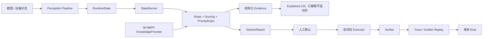

# Sanmou Monorepo 架构与迭代路径

更新时间：2026-05-30

## 输入文档结论

本文件基于两份外部 Markdown：

- `docs/sanmou-architecture-design.md`，由 `/Users/bytedance/Downloads/sanmou-architecture-design.md` 原样入库，是 canonical 架构 ADR。
- `/Users/bytedance/Downloads/compass_artifact_wf-e8a7f969-37b2-454b-a591-4cc7dff32f73_text_markdown.md`

第二份基本是第一份的 HTML 化版本，核心设计结论一致：

1. 当前方向正确：先做截图驱动 Advisor，再逐步走向半自动/托管 Agent。
2. 最大短板不是“没有模型”，而是推荐、证据、执行、验证之间缺闭环。
3. `pioneer-agent` 与 `qa-agent` 需要通过稳定 ports 对接，不能靠临时导入和字符串 evidence 长期维持。
4. LLM 应该用于解释、补充判断和少量 rerank，不应该直接创造高风险动作。
5. 自动化必须从低风险动作开始，并且每个动作都要有 verifier、trace、recovery 和 kill switch。

## 当前仓库校正

外部文档里有两处判断对当前仓库已经部分过时：

1. QA 不是完全孤岛。`pioneer-agent` 的 Advisor API 已经能懒加载 `qa-agent` 做聊天回答，`ActionSelector` 也会消费 `packages/pioneer-agent/data/strategy_snapshot.yaml`。
2. Verifier 不是完全缺失。仓库已有 `VerifierRegistry/VerifierSpec` 和执行前 gate，但具体动作的 expected delta、真实 UI handler、后置 observe 校验还没有打通。
3. Phase 1 的第一步 ports 已在本分支落地：`sanmou_common.ports` 提供 `Evidence/KnowledgeAnswer/KnowledgeProvider/ModelAdapter`，`qa_agent.adapters.QaKnowledgeProvider` 已实现最小 adapter。

因此下一步不应该重写架构，而应该补齐闭环。

## 架构审查修正

以下是对原始 ADR 的工程约束修正，作为后续 PR review 的默认准则：

- `KnowledgeProvider` 和结构化 `Evidence` 是主路径；`LLM-as-Judge` 不是主路径，只能在 replay baseline 稳定后作为实验开关接入。
- `ActionDSL` 暂不进入 `sanmou-common`。action 是 runtime 行为，先放在 `pioneer-agent` 内部，等出现跨包真实调用方再上提。
- `qa-agent` 的离线 vision 和 `pioneer-agent` 的实时 perception 不合并成一个 pipeline。它们可以共享底层模型工具、schema 规范和 canonical 对齐，但保留不同 latency、review、fallback 策略。
- `ModelAdapter` 当前只是最小 common Protocol。具体 vision provider、reasoning effort、image detail、fallback chain 先留在 `pioneer-agent` runtime 内部，不让 common 过早吸收模型脏细节。
- TOS、截图外传、history retention、账号标签保存属于架构约束，不是 Phase 3 才看的合规备注；所有 UI 自动化入口必须默认可停机、可追踪、可关闭。

停止条件：

- 没有结构化 evidence 和 entry_id validator 前，不接入推荐层 ExplainerLLM。
- 没有 golden replay baseline 前，不启用 LLM-as-Judge；`LLMJudgeGate` 默认关闭，打开后也会先检查 golden baseline 与 top2 分差。
- 低风险动作 verifier false positive 未被 fixture 覆盖前，不开放 semi-auto；`AutomationReadinessGate` 已接入 `UIActionRunner`。
- 低风险动作缺少 visible+enabled 且 0-1000 合法的 semantic bbox 时，不进入 dispatch；`claim_chapter_reward`、`recruit_soldiers`、`upgrade_building` 已由 `semantic_target_gate` 阻断。
- 地图识别、战报识别、队伍状态 verifier 未完成前，`attack_land`、`transfer_main_lineup`、`abandon_land` 不开放全自动；已由 architecture gate 阻断 full-auto。

## 目标架构



关键原则：

- `sanmou-common` 定义跨包契约。
- `qa-agent` 实现 `KnowledgeProvider`。
- `pioneer-agent` 只依赖 common Protocol，不直接绑定 QA 内部模型。
- 推荐结果必须带结构化 evidence，且 evidence 必须可校验。
- 执行动作必须先满足 safety gate 与 verifier gate。

## 模块设计文档

- `sanmou-common`：`docs/modules/sanmou-common-design.md`
- `qa-agent`：`docs/modules/qa-agent-design.md`
- `pioneer-agent`：`docs/modules/pioneer-agent-design.md`
- `sanmou-advisor-desktop`：`docs/modules/sanmou-advisor-desktop-design.md`

## P0：Advisor 可信闭环

周期：2-3 周。

目标：让每个 Advisor 推荐都能解释、能追溯、能回放。

待办：

- [x] 在 `sanmou-common` 增加最小 ports：`Evidence`、`KnowledgeAnswer`、`KnowledgeProvider`、`ModelAdapter`。
- [x] 在 `qa-agent` 增加 `QaKnowledgeProvider`，把现有 `QueryService` 转成 common 契约。
- [x] 把 `ActionRecommendation.evidence: list[str]` 升级为结构化 evidence，保留旧字符串 evidence 兼容。
- [x] Advisor 推荐中引用的 `entry_id` 必须来自真实检索结果或 `strategy_snapshot.yaml`。
- [x] 增加 citation/evidence validator，伪造 entry_id 必须失败。
- [x] 给视觉结构化输出加语义校验：bbox 范围、按钮可见性、页面 domain 一致性。
- [x] 建立截图 fixture + golden eval，覆盖首页、城内、章节、征兵、建筑升级、队伍。

验收标准：

- 同一批截图 replay 时，推荐 action、score、evidence、confidence 稳定。
- 无证据或伪造证据的推荐不会进入最终 AdvisorReport。

## P1：证据进入决策

周期：3-5 周。

目标：QA 知识不只用于聊天，还要参与推荐排序和解释。

待办：

- [x] 建筑升级推荐携带 `strategy_snapshot.entry_ids`，并展示对应知识证据。
- [ ] 征兵推荐结合资源、主力体力、队伍兵力缺口和开荒 baseline。
- [ ] 打地风险先做 Advisor 判断，不做自动执行。
- [ ] 阵容建议从 QA 知识库读取武将、战法、赛季队伍知识，只输出建议。
- [x] `ExplainerLLM` 只负责把 rule reason 和 evidence 讲清楚，不允许修改 action；`validate_explainer_boundary` 会拒绝 action type、params、risk、safety verdict 变更。
- [x] `LLM-as-Judge` 只在 top2 分数接近时作为实验开关启用，并且必须有 golden eval 后再接入；`ActionSelector.selection_reason.llm_judge_gate` 默认记录 skip。

验收标准：

- 推荐能展示 rule reason、retrieved evidence、final narrative。
- LLM 改写不会改变 action type、关键参数和 safety 结论。

## P2：低风险半自动

周期：4-8 周。

目标：只打通低风险动作闭环。

优先动作：

1. `claim_chapter_reward`
2. `recruit_soldiers`
3. `upgrade_building`

每个动作必须遵守：

```text
precheck -> click/action -> observe -> verifier -> trace -> recovery/block
```

待办：

- [x] 为三个低风险动作补 `VerifierSpec.expected_deltas`。
- [ ] 打通真实 UI action handler，不再返回 pending。2026-05-30 已完成 semantic bbox dispatch + dispatch 前 semantic-target gate + post-action verifier + immediate recovery 第一段闭环：`claim_chapter_reward`、`recruit_soldiers`、`upgrade_building` 可消费 vision validator 产出的 visible/enabled bbox 并派发一次 allowlisted click；缺失、disabled 或越界/反向 bbox 会在 `UIActionRunner` 被 `semantic_target_gate` block，不会进入未校准点击路径；通过 gate 的真实 dispatch 会把 `semantic_target_gate` allow verdict 写入 `ExecutionResult.summary`，并随 `AutonomousLoop` act trace 保存；PR5 replay 会对低风险动作跑 no-op `UIActionRunner` dry dispatch 并输出 `runtime_dispatch.summary.semantic_target_gate`；PR5 golden expectation fixture 已字段化记录 dispatch gate 期望，并由 replay 测试把章节/征兵/建筑升级真实截图选出的动作送入 runner，锁住 claim/recruit 缺可信 bbox 必须 block、upgrade 真实入口 bbox 可 dispatch；qa-agent MCP 已将该 gate 暴露为 `advisor_fixture_eval.dispatch_gate`、`advisor_fixture_eval.runtime_dispatch_gate`、`advisor_golden_replay_status.pr5_dispatch_gate_coverage` 与 `advisor_golden_replay_status.pr12_runtime_dispatch_coverage`，并用 `pr5_locked_field_coverage` 把 action/evidence/confidence/dispatch locked fields 缺失纳入 status gate，供 Codex/自动化按结构化结果验证；同日追加 `expected_dispatch_terminal_for_verifier` 与 `terminal_dispatch_gate`，`advisor_golden_replay_status.pr5_low_risk_terminal_dispatch_coverage` 只有在 `runtime_dispatch.status=ok` 且 `terminal_for_verifier=true` 时才计入终态覆盖，当前 claim/recruit 被 semantic gate block、upgrade 仍是 `open_upgrade_dialog` 非终态步骤，所以 status 保持 `attention`；MCP 同时输出 `attention_reasons` 与 `low_risk_verifier_readiness`，把当前 blocker 字段化为 `low_risk_terminal_dispatch_missing` / `missing_terminal_dispatch`，明确 verifier spec ready 但 terminal dispatch 未 ready；`advisor_fixture_eval.low_risk_readiness` 会对单个 fixture 细分 `semantic_dispatch_ready`、`runtime_dispatch_ready`、`terminal_dispatch_ready` 和 blockers，直接指出 claim/recruit 卡在 semantic target、upgrade 卡在 terminal confirm；`next_fixture_requirements` 会把下一张 golden/PR5 fixture 的 required page、semantic target、action param paths 与 expected runtime dispatch 一并输出；`AutonomousLoop` 会在成功点击后重新 observe，并用对应 `VerifierSpec` 校验 expected delta，失败会标记 `failed` + `recovery_required`，同 tick 发送一次 ESC recovery 并写入 trace。同日追加 `upgrade_building` 保守两段式 flow：`upgrade_button` 作为 non-terminal step，只允许一次 intermediate observe；重新选择到同一 `action_id` 的 terminal action 且出现 `upgrade_dialog.confirm_button` 后才点击确认并进入 verifier，否则直接 failed/recovery。claim/recruit 完整多步 flow 与 upgrade terminal confirm fixture 仍未完成。
- [ ] 弹窗识别接入动作流程，未知弹窗必须 block。
- [ ] 引入 UI element id 或 SoM grounding，减少裸坐标点击。
- [x] `SafetyGuard` 配置化，高风险动作默认 block；全自动高风险还需要通过 `AutomationReadinessGate` 的地图、战报、队伍 verifier 前置条件。
- [ ] trace replay 收集失败样本，进入 offline eval。

验收标准：

- 低风险动作可执行、可阻断、可恢复。
- 动作失败后不会继续连点或进入高风险流程。

## P3：半自动到托管

周期：3-6 个月。

目标：从 Advisor 到可托管 Agent，但每一步都能灰度回退。

阶段：

1. Advisor 稳定推荐。
2. 低风险动作半自动。
3. 人确认的打地辅助。
4. 低级地自动打地闭环。
5. 队伍调度、征兵、补体力联动。
6. 长时托管。

高风险动作如 `attack_land`、`transfer_main_lineup`、`abandon_land`，在没有地图识别、战报识别、队伍状态 verifier 前，不开放全自动。

## 下一批 PR 建议

1. [x] 结构化 evidence 接入 `AdvisorReport/ActionRecommendation`，保持 API 向后兼容。
2. [x] evidence validator 和 citation regression tests，伪造 `entry_id` 必须失败。
3. [x] `strategy_snapshot.entry_ids` 贯通到建筑升级推荐，并能反查 QA knowledge。
4. [x] vision schema 语义校验和失败 fixture，优先覆盖 bbox、visible/enabled、page/domain。
5. [x] Advisor golden replay runner 扩展真实截图集，锁住 action/evidence/confidence。
6. [x] 三个低风险动作的 verifier specs，不先写完整 click flow。
7. [x] 三个低风险动作的 semantic bbox dispatch first slice：消费 vision validator 产出的按钮 bbox，并通过 input allowlist 派发单次 click。
8. [x] `AutonomousLoop` post-action observe/verifier：成功点击后按 `VerifierSpec` 重新截图、同步 state、校验 delta，并把结果写入 execution/trace。
9. [x] `AutonomousLoop` immediate recovery：post-action verifier 失败时同 tick 发送一次 ESC，并把 recovery strategy 和 input trace 写入 trace。
10. [x] `upgrade_building` 两段式低风险 flow：入口点击后强制重新 observe，只有同一 `action_id` 的 terminal action 消费确认按钮时才进入 post-action verifier。
11. [x] 真实 `upgrade_button` fixture 断言：`city_buildings` 输出升级入口 semantic bbox，PR5 building screenshot golden replay 锁住 action params 与 `city.buildings` evidence。
12. [x] 低风险 semantic target dispatch gate：`UIActionRunner` 要求 claim/recruit/upgrade 的 action params 在 dispatch 前已有 visible+enabled 且合法的 semantic bbox；`upgrade_building` 可接受入口按钮或确认按钮，claim/recruit 缺可信 bbox 时保持 blocked。
13. [x] PR5 semantic target replay gate：`advisor_fixture_expectations.json` 字段化记录真实截图 replay dispatch 期望，claim/recruit 缺可信 bbox 时必须 `semantic_target_gate` block，建筑升级真实入口 bbox 必须仍可 dispatch。
14. [x] MCP dispatch gate surface：`advisor_fixture_eval` 返回 PR5 dispatch gate expected/actual/matched，`advisor_golden_replay_status` 汇总 dispatch gate coverage。
15. [x] Runtime semantic gate trace：低风险动作通过 dispatch gate 后，`ExecutionResult.summary.semantic_target_gate` 与 `AutonomousLoop` act trace 保留 allow verdict，便于回放和事故审计证明点击前门槛已满足。
16. [x] MCP runtime dispatch replay：`advisor_fixture_eval.runtime_dispatch_gate` 与 `advisor_golden_replay_status.pr12_runtime_dispatch_coverage` 验证 replay 的 no-op `UIActionRunner` 输出携带 semantic gate verdict。
17. [x] MCP locked field status gate：`advisor_golden_replay_status.pr5_locked_field_coverage` 要求 PR5 action/evidence/confidence/dispatch/runtime gate locked fields 齐全，缺失时 status 进入 `attention`。
18. [x] MCP terminal dispatch readiness gate：PR5 low-risk fixtures 字段化记录 `expected_dispatch_terminal_for_verifier`，MCP 区分“dispatch gate 匹配”与“已进入 verifier-ready 终态”；当前三类低风险动作仍无终态覆盖时 status 保持 `attention`。
19. [x] MCP structured attention/readiness：`advisor_golden_replay_status.attention_reasons` 与 `low_risk_verifier_readiness` 将 `attention` 原因字段化，当前唯一 blocker 为三类低风险动作 `missing_terminal_dispatch`。
20. [x] MCP fixture-level low-risk readiness：`advisor_fixture_eval.low_risk_readiness` 将单个 fixture 的 verifier、semantic dispatch、runtime dispatch、terminal dispatch 与 blockers 字段化，便于直接定位下一张真实 fixture 该补什么。
21. [x] MCP next fixture requirements：`low_risk_verifier_readiness.next_fixture_requirements` 和 fixture-level readiness 输出下一张低风险 golden fixture 需要的 page、semantic target、action param paths 与 expected runtime dispatch。
22. [ ] 三个低风险动作的完整 UI flow，继续补 claim/recruit 面板打开、数量/确认序列，以及 upgrade terminal confirm fixture。
23. [ ] Desktop evidence/degraded 展示，确保无证据推荐不会被 UI 展示成确定结论。
