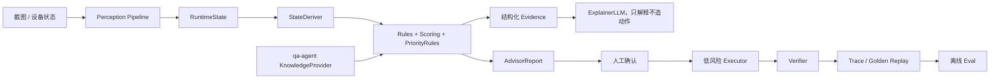

# Sanmou Monorepo 架构与迭代路径

更新时间：2026-05-19

## 输入文档结论

本文件基于两份外部 Markdown：

- `/Users/bytedance/Downloads/sanmou-architecture-design.md`
- `/Users/bytedance/Downloads/compass_artifact_wf-e8a7f969-37b2-454b-a591-4cc7dff32f73_text_markdown.md`

第二份基本是第一份的 HTML 化版本，核心设计结论一致：

1. 当前方向正确：先做截图驱动 Advisor，再逐步走向半自动/托管 Agent。
2. 最大短板不是“没有模型”，而是推荐、证据、执行、验证之间缺闭环。
3. `pioneer-agent` 与 `qa-agent` 需要通过稳定 ports 对接，不能靠临时导入和字符串 evidence 长期维持。
4. LLM 应该用于解释、补充判断和少量 rerank，不应该直接创造高风险动作。
5. 自动化必须从低风险动作开始，并且每个动作都要有 verifier、trace、recovery 和 kill switch。

## 当前仓库校正

外部文档里有两处判断对当前仓库已经部分过时：

1. QA 不是完全孤岛。`pioneer-agent` 的 Advisor API 已经能懒加载 `qa-agent` 做聊天回答，`ActionSelector` 也会消费 `packages/pioneer-agent/data/strategy_snapshot.yaml`。
2. Verifier 不是完全缺失。仓库已有 `VerifierRegistry/VerifierSpec` 和执行前 gate，但具体动作的 expected delta、真实 UI handler、后置 observe 校验还没有打通。

因此下一步不应该重写架构，而应该补齐闭环。

## 目标架构



关键原则：

- `sanmou-common` 定义跨包契约。
- `qa-agent` 实现 `KnowledgeProvider`。
- `pioneer-agent` 只依赖 common Protocol，不直接绑定 QA 内部模型。
- 推荐结果必须带结构化 evidence，且 evidence 必须可校验。
- 执行动作必须先满足 safety gate 与 verifier gate。

## P0：Advisor 可信闭环

周期：2-3 周。

目标：让每个 Advisor 推荐都能解释、能追溯、能回放。

待办：

- [x] 在 `sanmou-common` 增加最小 ports：`Evidence`、`KnowledgeAnswer`、`KnowledgeProvider`、`ModelAdapter`。
- [x] 在 `qa-agent` 增加 `QaKnowledgeProvider`，把现有 `QueryService` 转成 common 契约。
- [ ] 把 `ActionRecommendation.evidence: list[str]` 升级为结构化 evidence。
- [ ] Advisor 推荐中引用的 `entry_id` 必须来自真实检索结果或 `strategy_snapshot.yaml`。
- [ ] 增加 citation/evidence validator，伪造 entry_id 必须失败。
- [ ] 给视觉结构化输出加语义校验：bbox 范围、按钮可见性、页面 domain 一致性。
- [ ] 建立截图 fixture + golden eval，覆盖首页、城内、章节、征兵、建筑升级、队伍。

验收标准：

- 同一批截图 replay 时，推荐 action、score、evidence、confidence 稳定。
- 无证据或伪造证据的推荐不会进入最终 AdvisorReport。

## P1：证据进入决策

周期：3-5 周。

目标：QA 知识不只用于聊天，还要参与推荐排序和解释。

待办：

- [ ] 建筑升级推荐携带 `strategy_snapshot.entry_ids`，并展示对应知识证据。
- [ ] 征兵推荐结合资源、主力体力、队伍兵力缺口和开荒 baseline。
- [ ] 打地风险先做 Advisor 判断，不做自动执行。
- [ ] 阵容建议从 QA 知识库读取武将、战法、赛季队伍知识，只输出建议。
- [ ] `ExplainerLLM` 只负责把 rule reason 和 evidence 讲清楚，不允许修改 action。
- [ ] `LLM-as-Judge` 只在 top2 分数接近时启用，并且必须有 golden eval 后再接入。

验收标准：

- 推荐能展示 rule reason、retrieved evidence、final narrative。
- LLM 改写不会改变 action type、关键参数和 safety 结论。

## P2：低风险半自动

周期：4-8 周。

目标：只打通低风险动作闭环。

优先动作：

1. `claim_chapter_reward`
2. `recruit_soldiers`
3. `upgrade_building`

每个动作必须遵守：

```text
precheck -> click/action -> observe -> verifier -> trace -> recovery/block
```

待办：

- [ ] 为三个低风险动作补 `VerifierSpec.expected_deltas`。
- [ ] 打通真实 UI action handler，不再返回 pending。
- [ ] 弹窗识别接入动作流程，未知弹窗必须 block。
- [ ] 引入 UI element id 或 SoM grounding，减少裸坐标点击。
- [ ] `SafetyGuard` 配置化，高风险动作默认 block。
- [ ] trace replay 收集失败样本，进入 offline eval。

验收标准：

- 低风险动作可执行、可阻断、可恢复。
- 动作失败后不会继续连点或进入高风险流程。

## P3：半自动到托管

周期：3-6 个月。

目标：从 Advisor 到可托管 Agent，但每一步都能灰度回退。

阶段：

1. Advisor 稳定推荐。
2. 低风险动作半自动。
3. 人确认的打地辅助。
4. 低级地自动打地闭环。
5. 队伍调度、征兵、补体力联动。
6. 长时托管。

高风险动作如 `attack_land`、`transfer_main_lineup`、`abandon_land`，在没有地图识别、战报识别、队伍状态 verifier 前，不开放全自动。

## 下一批 PR 建议

1. 结构化 evidence 接入 `AdvisorReport/ActionRecommendation`。
2. `strategy_snapshot.entry_ids` 贯通到建筑升级推荐。
3. evidence validator 和 citation regression tests。
4. vision schema 语义校验和失败 fixture。
5. Advisor golden replay runner 扩展真实截图集。
6. 三个低风险动作的 verifier specs。
